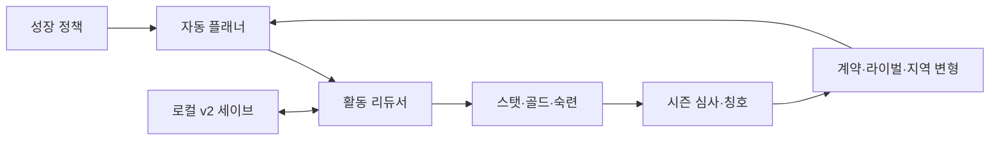

# Princess Tycoon: 왕립 아카데미

성장 방향과 안전 규칙을 정하면 성인 수련생이 학습·아르바이트·휴식·모험·시험·스포츠·대회를 스스로 선택해 계속 성장하는 세로형 모바일 방치형 육성 시뮬레이션입니다.

기존 Princess Maker 2 역공학 자료는 콘텐츠 밀도와 역사적 UI를 분석하기 위한 레퍼런스로만 남겼습니다. 강제 18세 엔딩, 월 1회 수동 선택, 미성년 성적 묘사, 원작 에셋의 런타임 사용은 현대형 제품에서 제거했습니다.

## 제품 핵심

- 강제 엔딩 없이 시즌·세계 티어·활동 숙련·진로 칭호가 무한히 확장됩니다.
- `균형/무예/학문/예술/리더십/돌봄/탐험/번영` 또는 사용자 정의 성장 정책을 설정합니다.
- 결정적 자동 플래너가 예산, 스트레스, 위험도, 금지 태그를 지키며 다음 활동을 고릅니다.
- 오프라인 진행은 최대 8시간을 같은 리듀서로 정산합니다.
- 기본 콘텐츠: 활동 43종, 이벤트 26종, 상점 21종, 진로 칭호 38종.
- 원작 추출물 대신 Godot 절차 드로잉과 OFL 한글 폰트를 사용합니다.

## 실행

```bash
# 에디터
godot --editor --path godot

# 게임
godot --path godot

# 문서·데이터·Godot import/compile/smoke
npm test

# 장기 밸런스 시뮬레이션
npm run test:balance

# Web release export → build/web
npm run build:web
```

Godot 프로젝트 호환 기준은 4.6.x, 렌더러는 GL Compatibility, 내부 화면은 390×844 세로형입니다.

## 구조

```text
docs/
  00~09_*.md                    원작 분석과 유한형 육성 SIM 레퍼런스
  10_현대형_무한성장_GDD.md     현대형 제품 구현 정본
  11_현대형_구현계약.md         데이터·공식·세이브·인수조건 정본
  12_구현_QA_증거.md            자동 테스트·밸런스·실렌더·Web export 증거
  qa/                           3개 모바일 비율·결과 피드백 실제 렌더
extract/                        역공학 도구와 연구용 추출물(런타임 미포함)
godot/
  assets/fonts/                 라이선스가 확인된 번들 한글 폰트
  data/                         밸런스와 콘텐츠 JSON
  scenes/                       모바일 화면
  src/core/                     결정적 게임 규칙과 세이브
  src/ui/                       절차 비주얼과 화면 제어
  tests/                        코어·런타임·레이아웃·밸런스 검증
scripts/                        문서·데이터·Godot 품질 게이트
```

## 설계 흐름



## 저작권·에셋 정책

- `extract/`의 이미지, 폰트, 텍스트, 음원은 분석·재현 레퍼런스 전용입니다.
- 실행 빌드에는 신규 절차 비주얼과 라이선스가 확인된 폰트만 포함합니다.
- 유료 이미지/음악 생성 API, 원작 리소스, 실제 광고/IAP SDK는 1차 구현 범위에 포함하지 않습니다.

## 검증 결과

- 코어 244/244, 수용 기준 보강 28/28, 런타임 36/36, 레이아웃 79/79 PASS
- 플랫폼 포트 16/16·UI 연결 10/10, 결과·모션 UI 37/37 PASS
- 390×844, 430×932, 720×1280 GL Compatibility 실제 렌더 PASS
- 390×844 활동 결과 피드백 실제 렌더 PASS
- Web release export PASS

명령, 밸런스 수치, 스크린샷과 범위 감사는 [`docs/12_구현_QA_증거.md`](docs/12_구현_QA_증거.md)에 기록했습니다.

## 원작 분석 자료

`docs/00~09`와 `extract/catalog/`에는 FLIB/LBX 구조, 16색 팔레트, 페이퍼돌 레이어, 활동·스탯·대회·상점·모험·38개 대표 엔딩 분석이 남아 있습니다. 현대형 구현과 충돌할 때는 `docs/10`, `docs/11`이 우선합니다.
