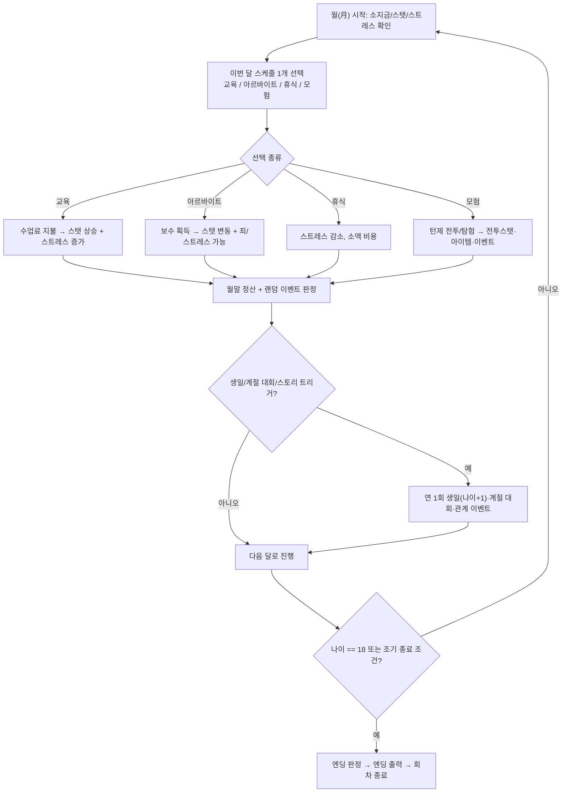

# Princess Tycoon — 모바일 육성 시뮬레이션 기획서 (개요)

> 원작: **Princess Maker 2** (1993, GAINAX / NineLives) — 한국어판(KOR) 역공학 기반
> 목적: 원작의 비주얼 컨셉·게임 데이터·사운드·밸런스·게임 시스템을 추출/재구성하여,
> **이 문서 묶음만으로 개발팀이 별도 지시 없이 모바일향 육성 SIM을 그대로 만들 수 있는 수준**의 기획서를 제공한다.

---

## 0. 이 기획서의 사용법

본 기획서는 다음 문서로 구성된다. 구현 시 **번호 순서대로** 읽으면 컨셉 → 시스템 → 데이터 → 인수조건 순으로 막힘 없이 진행된다.

| # | 문서 | 내용 | 구현 시 역할 |
|---|------|------|-------------|
| 00 | `00_기획서_개요.md` | 본 문서. 전체 인덱스·완성조건·용어 | 진입점 |
| 01 | `01_원작분석_메타데이터.md` | 원작 식별·기술사양·파일 인벤토리·역공학 결과 | 출처/근거 |
| 02 | `02_비주얼_컨셉.md` | 아트 스타일·팔레트·화면 레이아웃·캐릭터 아트 | 아트팀 |
| 03 | `03_게임시스템_명세.md` | 코어 루프·시간/스케줄·스탯·전투·관계 시스템 | 시스템 개발 |
| 04 | `04_밸런스시트.md` | 스탯/수업/아르바이트/상점/공식 수치 (표·CSV) | 데이터/밸런스 |
| 05 | `05_이벤트_엔딩.md` | 이벤트 전체·대회·엔딩 분기 조건 | 콘텐츠/내러티브 |
| 06 | `06_모바일_적응설계.md` | 터치 UX·세로 레이아웃·세션·수익화·접근성 | 모바일 UX |
| 07 | `07_기능별_인수조건.md` | 기능별 Given/When/Then 인수조건 (검수 기준) | QA/검수 |
| 08 | `08_데이터스키마_세이브.md` | 데이터 스키마·세이브 포맷·상태 머신 | 백엔드/저장 |
| — | `../extract/` | 역공학으로 추출한 실제 에셋(이미지/팔레트/폰트/텍스트) + 추출 도구 | 에셋 원본 |

데이터 표는 `04`와 `08`에 집중되어 있으며, 동일 수치는 한 곳(=원천)에만 두고 나머지는 참조한다.

---

## 1. 한 줄 정의

> **"신으로부터 맡겨진 10세 소녀를, 18세가 될 때까지 8년간 매월 스케줄(교육·아르바이트·휴식·모험)로 길러, 누적된 능력치·평판·죄·신앙·관계에 따라 70여 종의 엔딩 중 하나로 떠나보내는 라이프 육성 시뮬레이션."**

- 장르: 육성 시뮬레이션 + 경량 턴제 RPG(모험/전투) + 미니게임(대회)
- 1회차 길이(원작): 약 4~8시간 / 모바일 목표: **1세션 3~7분, 1회차 2~4시간(중단·재개 자유)**
- 핵심 동사: **스케줄을 짠다 → 결과를 확인한다 → 능력치를 키운다 → 엔딩으로 향한다**

---

## 2. 코어 루프 (모바일 기준)

타임스케일 응답(설계 기준):
- **10초**: 스케줄 카드 1개를 고르고 결과 애니메이션/스탯 증감을 본다.
- **3분**: 한 학년(분기)의 스케줄을 짜고 결과·이벤트를 소화한다.
- **30분**: 한 해(생일~다음 생일)를 돌려 능력치 빌드 방향이 갈린다.
- **수일/회차**: 8년을 완주해 엔딩을 보고, 다른 빌드로 재도전(엔딩 컬렉션).

---

## 3. 완성조건(Definition of Done) — 본 기획서가 충족해야 하는 기준

이 기획서는 아래가 **모두** 충족될 때 "지시 없이 그대로 제작 가능" 상태로 본다.

- [x] **C1. 시스템 완전성**: 시간·스케줄·스탯·전투·상점·관계·이벤트·엔딩의 입력/출력/상태전이가 빠짐없이 명세됨 (문서 03 14개 시스템, 05).
- [x] **C2. 수치 결정성**: 모든 스탯 상승/하락, 비용, 확률, 보수, 공식이 구체 상수로 표에 존재 (문서 04). "적당히"라는 표현이 없음.
- [x] **C3. 비주얼 결정성**: 해상도·팔레트·화면별 레이아웃·캐릭터 표현·UI 컴포넌트가 와이어프레임 7종 + 추출 에셋으로 명세 (문서 02 + `extract/`).
- [x] **C4. 인수조건**: 모든 기능에 Given/When/Then 검수 기준 81개가 존재 (문서 07).
- [x] **C5. 데이터 스키마**: 세이브/로드 스키마, 데이터 테이블 구조, 마이그레이션, 결정적 리듀서 명세 (문서 08).
- [x] **C6. 에셋 가용성**: 폰트·16색 팔레트·서브이미지 인벤토리(3,608개)·포맷 스펙·텍스트 스크립트가 `extract/`에 실물 존재. 미해제분(최종 픽셀/256색 팔레트/TX 대사)은 사유와 복원 가이드 명시 (문서 01 §8).
- [x] **C7. 범위 경계**: 포함/제외(서버·결제 SDK·멀티플레이·원작 에셋 상용배포 등) 범위가 `Not Included`로 명시 (§5, 문서 06·09).

각 문서 말미에 해당 조건 충족 체크리스트를 둔다. **전 조건(C1–C7) 충족.**

---

## 4. 용어 사전 (전 문서 공통)

| 용어 | 정의 |
|------|------|
| 아버지(Father)/플레이어 | 전쟁 영웅. 소녀의 양육자. 플레이어 분신. 직접 능력치는 없고 가문 평판/재산을 가짐 |
| 딸(Daughter) | 육성 대상. 이름은 플레이어가 지정. 10세 시작, 18세 종료 |
| 큐브(Cube)/집사 | 신이 붙여준 마족(악마) 도우미. 조언·월말 보고·상점 안내, 때때로 유혹 |
| 여신(어머니) | 딸의 명목상 어머니. 신앙·축복 관련 이벤트 |
| 스케줄(Schedule) | 한 달 단위로 딸에게 부여하는 활동 1종 |
| 교육/수업(Class) | 학교/도장에 보내 능력치를 올리는 활동. 수업료 지출 |
| 아르바이트(Arbeit/Work) | 돈을 벌고 능력치를 변동시키는 활동. 일부는 죄·스트레스 증가 |
| 모험(Expedition) | 딸이 떠나는 탐험/전투. 턴제 RPG 파트 |
| 스트레스(Stress) | 누적 피로. 과도하면 반항·가출·능력치 페널티 |
| 죄(Sin) | 비도덕 행위로 누적. 엔딩과 평판에 악영향 |
| 평판(Reputation) | 세간의 평가. 대회 입상·선행으로 상승 |
| 자존심/기질(Temperament) | 딸의 성격 파라미터. 반항/순종 반응에 영향 |
| 엔딩(Ending) | 18세 시점(또는 조기 종료) 능력치/관계로 결정되는 결말 |
| 회차(Run) | 1명의 딸을 10→18세까지 기르는 1 플레이 사이클 |

---

## 5. 범위 경계 (Not Included — 1차 출시 기준)

- **서버/온라인**: 전면 오프라인. 랭킹/클라우드 세이브는 2차(선택). 본 문서 구현 범위 아님.
- **실결제 SDK**: 광고/IAP는 플레이스홀더 훅만(문서 06). 실 SDK 연동은 별도.
- **멀티플레이**: 없음.
- **원작 텍스트 원문 그대로 사용**: 저작권 문제. 시스템/수치/구조만 차용하고 **텍스트·고유 캐릭터 디자인은 신규 창작**. (역공학 텍스트는 구조 분석·길이/톤 참고용)
- **원작 에셋 그대로 상용 배포**: 추출 에셋은 **레퍼런스/재현 기준**으로 사용하고, 상용 빌드는 동일 컨셉의 신규 아트로 대체(문서 02의 "재제작 가이드" 참조).

---

## 6. 현재 역공학 진행 상태(요약)

세부는 `01_원작분석_메타데이터.md` 및 `extract/catalog/` 참조. **핵심 역공학 완료.**

| 항목 | 결과 |
|------|------|
| 아카이브 | **FLIB**(Hashimoto, 1993), `LIBINDEX.DIR`로 전 LBX 콘텐츠 매핑 확정 |
| 그래픽 포맷 | 서브이미지 체인 + 16B 헤더 + RLE(2바이트 단위), type2 그림+type3 마스크. **3,608 서브이미지 인벤토리.** 320×200 8bpp |
| 캐릭터 | 페이퍼돌: GD(연령10–17)+DD(드레스)+F*(표정)+FX. 함수 `WWGIRL(나이,표정,의상)` |
| 텍스트 | 인코딩 **조합형(Johab)** 확정, TX*=LZSS 압축. 게임=이벤트 스크립트 VM |
| 사운드 | **KAJA PMD(FM/SB)+MMD(MT-32/GM)**, BGM 31·징글 7·SE 16 |
| 폰트 | 완전 추출(ENG CP437 8×16, HAN Johab 16×16) |
| 후속(선택) | 그래픽 최종 픽셀·256색 팔레트·TX 대사 → `PM2.EXE` 디스어셈블/DOSBox 덤프 (문서 01 §8.2) |

---

_다음 문서: `01_원작분석_메타데이터.md`_
