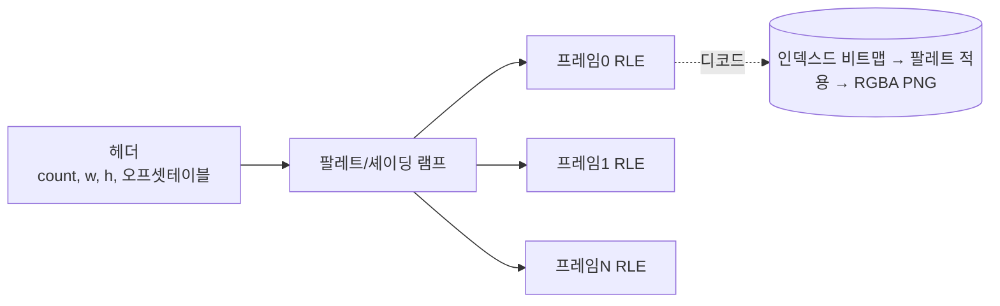

# 01. 원작 분석 및 메타데이터

> 역공학 대상: `Princess Maker 2 (KOR)/` — DOS 게임 데이터 일습

---

## 1. 원작 식별

| 항목 | 내용 | 근거 |
|------|------|------|
| 제목 | Princess Maker 2 (프린세스 메이커 2) | 폴더명, `PM2.EXE`/`PM2.CNF`, `LIBINDEX.DIR`의 `PM2E*` 항목 |
| 개발/판권 | GAINAX (원작), 한국어판 로컬라이즈 | `LIBINDEX.DIR` 내 `1993(C)R.` / `HASHIMOTO` 서명 |
| 원작 출시 | 1993 (PC-98/DOS), 본 빌드 파일 타임스탬프 1993~1999 | 파일 mtime |
| 플랫폼 | MS-DOS (실행 `PM2.EXE`, 런처 `PLAY.BAT`) | `PLAY.BAT` = `@echo off / PM2.EXE` |
| 언어 | 한국어(KOR) — 전용 한글 비트맵 폰트 탑재 | `HAN.FNT`(한글), `ENG.FNT`(영문) |
| 장르 | 딸 육성 시뮬레이션 + 경량 턴제 RPG | 본문 시스템 분석 |

> ⚠️ 저작권: 원작 시스템/수치/구조는 본 기획서의 분석 대상이나, **상용 제작 시 텍스트·캐릭터·에셋은 신규 창작**으로 대체한다(개요 문서 §5).

---

## 2. 기술 사양 (원작)

| 항목 | 값 | 비고 |
|------|----|----|
| 화면 해상도 | **640 × 480 px** (mode 12h) / 보조 640×200 (mode E) | DOSBox-X `-debug` 로그로 확정(`Set Video Mode 12`/`E`). mode 13h 아님 |
| 색상 | **16색 플레이너** (4 비트플레인) | EGA/VGA 16색. 256색 DAC 로드 없음(정정) |
| 팔레트 | 16색(`BACK.DAT` 6bit×4) | `extract/assets/palette/back_dat_16.json` |
| 픽셀 종횡비 | 640×480 정사각 / 640×200 세로압축 | 모바일 재현 시 보정 |
| 사운드/음악 | **MIDI 계열**: GM / MT-32 / SoundBlaster FM | `PM2.CNF`: `MUSIC = 5`(=GM+SB), 옵션 1~5 |
| 사운드 드라이버 | `MMD.COM`(Music Driver), `PMDL.COM`(PMD Loader) | DOS .COM, INT 21h 기반 |
| 메모리 | EMS 사용 (`EMS = 1`, `*.EMS` 파일) | `NAMEFILE.EMS` 등 |
| 입력 | 키보드 + 마우스(메뉴 클릭형 UI) | 메뉴/아이콘 기반 |

### 2.1 PM2.CNF 원문
```
# PM2 configration file.
# 1=SB 2=MT-32 3=GM 4=MT-32+SB 5=GM+SB
# 1=ems all load
MUSIC = 5
EMS = 1
```
→ 음악 시스템은 MIDI 멀티-디바이스 지원. 모바일에서는 **GM 사운드폰트/오디오 트랙으로 재현**(문서 02 사운드 섹션).

---

## 3. 파일 인벤토리 (전체)

`Princess Maker 2 (KOR)/` 59개 파일. 분류:

### 3.1 실행/시스템
| 파일 | 크기 | 종류 | 비고 |
|------|------|------|------|
| `PM2.EXE` | 174,728 | DOS MZ 실행파일 | 게임 본체 |
| `SETUP.EXE` | 149,282 | DOS MZ 실행파일 | 환경설정(사운드 카드) |
| `MMD.COM` | 4,784 | DOS .COM | 음악 드라이버 |
| `PMDL.COM` | 7,691 | DOS .COM | PMD 로더 |
| `PLAY.BAT` | 20 | 배치 | 런처 |
| `PM2.CNF` | 107 | 텍스트 | 사운드/EMS 설정 |
| `LIBINDEX.DIR` | 3,640 | 텍스트 인덱스 | LBX 파일↔논리명 매핑 룰 |

### 3.2 폰트
| 파일 | 크기 | 사양 |
|------|------|------|
| `ENG.FNT` | 4,096 | 8×8 1bpp ASCII 비트맵 (글리프당 8바이트, 256자=2048B + 헤더/여백) |
| `HAN.FNT` | 11,520 | 16×16 1bpp 한글 비트맵 (글리프당 32바이트, 약 360자) |

### 3.3 그래픽 LBX (FLIB 컨테이너, 멤버는 `*.PT1` 등) — **역공학 확정**
> `LIBINDEX.DIR`의 논리명→아카이브 매핑으로 각 LBX 내용 확정(`extract/catalog/DATA_CATALOG.md` §1,7). 픽셀 디코딩은 별도(이미지 에이전트).

| 파일 | 크기 | 확정 내용 | 멤버 패턴 |
|------|------|----------|-----------|
| `X1.LBX` | 1,390,970 | **이벤트 일러스트(CG)** | `E0*/L0*.PT1` |
| `Z0.LBX` | 1,217,346 | **엔딩 일러스트** | `Z0*` |
| `Z4.LBX` | 792,978 | **엔딩 일러스트** | `Z4*` |
| `DD.LBX` | 1,150,064 | **의상(드레스) 그래픽** — 의상 교체 레이어 | `DR?X1*` |
| `VV.LBX` | 833,464 | **바캉스 배경** | `V0*` |
| `J0.LBX` | 696,178 | **스케줄 화면 그래픽** | `J0*.PT1`, `T003B*` |
| `RPG.LBX` | 557,814 | **무사수행(모험) 맵·칩** | `MAP*`, `CIP*` |
| `RP2.LBX` | 394,740 | 무사수행 맵·칩 보조 | `MAP*`, `CIP*` |
| `T0.LBX` | 334,650 | 마을/타운 그래픽 | `T0*` |
| `OP.LBX` | 330,442 | **오프닝 그래픽** | `OPN*` |
| `FM.LBX` | 321,418 | 얼굴/표정(Face) | `F*.PT1` |
| `GD.LBX` | 284,090 | **딸 본체 스프라이트(GIRL)** | `GIRL1*` |
| `EN.LBX` | 228,544 | **엔딩 일러스트** | `END*.PT1` |
| `MG/MM.LBX` | 218K/178K | **음악**(그래픽 아님 — §5) | `G*.MMD`/`P*.MMD` |
| `SS.LBX` | 161,252 | 미스/UI 그래픽 | `SS*` |
| `G0.LBX` | 134,608 | 미스/UI 그래픽 | `G0*` |
| `FA/FC/FE/FG/FO/FP/FQ/FS/FT/FV/FW/FX.LBX` | 22K~202K | **얼굴/표정·프레임 스프라이트** | `F*.PT1`, `FRM*` |
| `OU.LBX` | 22,876 | 오프닝 보조 | `E19*` |
| `X2.LBX` | 15,652 | **상점 그래픽** | `F074–F077.PT1` |
| `SF/P0/ROOT.LBX` | 60K/19K/93K | UI/프레임/루트 멤버 | `FRM*` 등 |

> 캐릭터 표현은 `GD.LBX`(GIRL 본체) + `F*.LBX`(얼굴/표정) + `DD.LBX`(의상) **레이어 합성**. 원작 그리기 함수 `WWGIRL(mode, 나이, frame, 표정, _, 의상번호, _)`가 이를 증명(§7).

### 3.4 텍스트/스크립트 LBX (TX 접두) — **역공학 확정**
> **이들은 단순 텍스트가 아니라 게임 이벤트 스크립트(VM 바이트코드 + Johab 한글 대사)다.** 한글 인코딩 = **조합형(Johab)** 확정. 압축은 **FLIB/LZSS**(암호 아님). 상세 §6, §7, `DATA_CATALOG.md` §2.

| 파일 | 크기 | 확정 내용 | 논리명 | 상태 |
|------|------|----------|--------|------|
| `TXTX.LBX` | 87,374 | **테스트/디버그 스크립트(비압축)** → 해독 완료 | `TEST*` | ✅ `extract/text/TXTX_script.txt` |
| `TXEE.LBX` | 254,194 | 엔딩 스크립트 | `EE*` | 🟡 압축 |
| `TXEV.LBX` | 130,384 | 이벤트 스크립트 | `EV*` | 🟡 압축 |
| `TXJO.LBX` | 93,148 | 직업/아르바이트 스크립트 | `JOB*` | 🟡 압축 |
| `TXOP.LBX` | 5,850 | 오프닝 스크립트 | `OPEN*` | 🟡 압축 |
| `TXRP.LBX` | 84,414 | 무사수행(전투) 스크립트 | `RPG*/RPY*/RPZ*` | 🟡 압축 |
| `TXRT.LBX` | 82,540 | 메인 루틴/메인루프 | `MAIN*/STAR*/KAIM*/PARA*/SCN*` | 🟡 압축 |
| `TXS.LBX` | 100,548 | 수확제 스크립트 | `SS*` | 🟡 압축 |
| `TXS2.LBX` | 25,330 | 수확제 스크립트 v2 | `SSA*` | 🟡 압축 |
| `TXTR.LBX` | 57,904 | 훈련 스크립트 | `TR*` | 🟡 압축 |

🟡 = LZSS 압축 구조 확인, 바이트 정확 해제는 `PM2.EXE`의 FLIB 디컴프레서 디스어셈블 필요(§6, `DATA_CATALOG.md` §2.4).

### 3.5 데이터/기타
| 파일 | 크기 | 추정 |
|------|------|------|
| `NAMEFILE.EMS` | 15,919 | 선택 가능 이름 목록(딸 이름 후보) |
| `BACK.DAT` | 43,964 | 배경/세이브 템플릿(추정) |
| `EN.LBX` | 228,544 | 엔딩(Ending) 그래픽/데이터(추정) |

---

## 4. LBX 아카이브 포맷 (역공학)

### 4.1 인덱스 파일 `LIBINDEX.DIR`
ASCII 텍스트. 논리적 리소스명(STAR*, DSKT*, MAIN*, KAIM* 등)을 물리 LBX(TXRT, ROOT 등)에 매핑하는 룰 테이블.
```
###########
#FLIBindex#
#1993(C)R.#
#HASHIMOTO#
###########
$FS FDskip
$UB f#0=B:
###########
F1??.GNX  a
N*.EMS    a
PMD*.COM  a
...
STAR* TXRT a   # STAR로 시작하는 리소스 → TXRT.LBX
DSKT* ROOT a
MAIN* TXRT a
KAIM* TXRT a   # 추정: 이벤트/카임 관련
```
→ 게임은 논리명으로 리소스를 요청하고, 이 룰로 실제 LBX 파일을 찾는다. **모바일 재현 시에는 논리명을 에셋 키로 직접 사용**(아카이브 불필요).

### 4.2 FLIB 아카이브 — **확정**
`LIBINDEX.DIR` 자체 서명 `#FLIBindex# #1993(C)R.# #HASHIMOTO#` → 전 `*.LBX`는 **FLIB**(Hashimoto, 1993, 일본 라이브러리) 컨테이너. `LIBINDEX.DIR`이 논리 8.3 파일명(와일드카드 `*`/`?`)→물리 아카이브 매핑 마스터 테이블. 멤버는 `*.PT1`(그림), `*.M/*.MMD`(음악), 스크립트 등.

### 4.3 그래픽 멤버 구조 — **역공학 검증 완료** (`extract/catalog/ASSET_CATALOG.md`)
이미지 LBX = 중앙 디렉터리 없는 **서브이미지 체인**. 각 서브이미지 = 16바이트 헤더 + RLE 본문. 46개 LBX에서 **3,608개 서브이미지** 카탈로그화(`lbx_inventory.csv`).

**서브이미지 헤더(16B, LE uint16):**
| off | 필드 | 의미 |
|----|------|------|
| +0 | type | 2=메인 이미지, 3=컴패니언(마스크/그림자/외곽) |
| +2/+4/+6 | f1/f2/f3 | 스프라이트 좌상단 x/y, 보조 치수 |
| +8 | **WIDTH** | 디컴프 폭(px) |
| +10 | **SIZE** | 체인 크기 → `next = cur + 12 + SIZE` |
| +12 | FRAMES | 1=단일, N=N프레임 시트 |
| +14 | flags | 0xFFFF / 0 / 팔레트id성 |
| +16~ | RLE 본문 | 길이 = SIZE-4 |

- **t2/t3 페어링**: DD/GD/Z0/Z4/J0/T0/SS/SF/G0/OU에서 type-3(소·마스크) + type-2(대·그림)가 동일 좌표로 교대 → **알파 마스크/그림자 합성용**. (모바일 재현 시 그림+마스크 2레이어로 옮김.)
- **RLE/LZ77 코덱 — 해결**(`PM2.EXE` @0x9190 디스어셈블). **워드 단위 LZ77**: `W=lodsw; W==0 종료; (W&0x8000)==0→리터럴 W워드; else cnt=W&0x7FFF워드, off=lodsw, dest−off에서 cnt워드 역참조`(dest 0프리필). 에이전트가 본 `B`=백레퍼런스 오프셋. 객관 검증: 좌-동일률 0.52, 세로 동일률이 `W=field[8]`에서 최대(노이즈면 0.004). 높이=`(declen+2)/W`. → 구현 `extract/tools/decode_images.py`, **type-2 1,879장 디코드** → `extract/assets/images_decoded/`.
- **미해결(진행 중)**: 256색 팔레트는 파일에 없고 런타임 VGA DAC 생성(장면별) → **DOSBox 캡처/디스어셈블로 추출 중**. 회색조 디코드는 인덱스값(팔레트 적용 시 컬러 완성).
- `BACK.DAT`: 640×480/400 지오메트리 + **16색 셋업 팔레트**(→ `extract/assets/palette/back_dat_16.{json,png}`).



---

## 5. 사운드/음악 시스템 — **확정 (KAJA PMD + MMD)**

- 드라이버(둘 다 KAJA / M. Kajihara 작):
  - `PMDL.COM` = `Music Driver P.M.D. for IBMPC/OPL Version 4.5e` → **PMD FM 합성**(OPL2/OPL3 = SoundBlaster FM).
  - `MMD.COM` = `.mmd player ver.2.0` → **MMD 시퀀스 재생**(MT-32 / General MIDI).
- 음악 데이터(FLIB 멤버, **SMF/MThd 아님 — 네이티브 PMD/MMD**):
  - `MP.LBX`=`P*.M`(PMD 컴파일 FM 곡), `MB.LBX`=`B*.M*`(PMD 뱅크/리듬),
  - `MG.LBX`=`G*.MMD`(GM 시퀀스), `MM.LBX`=`P*.MMD`(MT-32 시퀀스). 멤버명에 `PM2 M1 [GM]/[MT]` 등.
- `PM2.CNF`의 `MUSIC` 1~5 = SB(FM) / MT-32 / GM / MT-32+SB / GM+SB. 효과음은 `SE1~SE16`(스크립트 §7).
- **장면별 BGM/SE 목록은 스크립트에서 확정**(문서 02 §9, §7). 모바일 재현: 장면별 신규 작곡/라이선스, 원곡은 구조 참고만(저작권).

---

## 6. 한글 처리 — **확정 (조합형 Johab)**

- 한글 인코딩 = **조합형(Johab)** 확정. 비압축 `TXTX.LBX`를 Python `johab` 코덱으로 클린 디코딩(4,602 음절) → 증명.
- 폰트:
  - `HAN.FNT`(11,520B) = **16×16 Johab 한글 자모(초성/중성/종성) 합성 폰트**, 360 글리프. 텍스트 렌더러이지 별도 인코딩 아님.
  - `ENG.FNT`(4,096B) = **8×16 ASCII 폰트**(256 글리프 × 16B).
- 텍스트 LBX는 **암호가 아니라 LZSS 압축**: 평문 엔트로피 5.99 vs 인코딩 7.41(압축만이 엔트로피를 평문 위로 올림), period-2 IC, 모든 cipher 후보 노이즈. 공유 매직 `01 04 14 a2 c1 76`. 바이트 정확 해제는 `PM2.EXE` 디컴프레서 디스어셈블 필요(`DATA_CATALOG.md` §2).
- 모바일 재현: **유니코드/시스템 폰트**. 원작 폰트는 픽셀 스타일 레퍼런스로만 보존.

---

## 7. 원작 이벤트 스크립트 엔진 — **확정 (TXTX 해독)**

게임 로직은 **전용 스크립트 VM**으로 구동된다(`PM2.EXE`가 인터프리터). 해독된 `TXTX_script.txt`에서 명령·변수·씬이 드러남.

**주요 명령**: `IF(...)` 분기, `SLCT("a,b,c")` 메뉴 선택, `LOAD()/LOADXX()` 스크립트/모듈 로드, `PLAY(n)/MUSIC()` BGM, `WWGIRL(mode,나이,frame,표정,_,의상번호,_)` 딸 그리기, `WWIVENT()` 이벤트 창, `WWPROF()` 프로필, `CLENDER(5,year,month,day)` 캘린더(생년월일), `TXGOLD()/GOLDADD()` 소지금, `PARC(1,"ENDING.COM"/"NAMEIN.COM",...)` 외부 모듈(엔딩 계산·이름입력) 호출, `RANDAM()`, `*LABEL`, `.VAR`, `;comment`.

**확정된 핵심 변수**: `P_NENREI`(나이 10~17), `P_BORTHYEAR/MONTH/DAY`(생년월일), `DRESS_NUM`(의상번호), 이벤트조건/이벤트실행횟수 플래그.

**⚠️ 스크립트 이중 인코딩**: 플레이어 문자열 = 조합형(Johab) 한국어, `;` **주석 = 미한글화된 원작 일본어 Shift-JIS**. 따라서 전체를 Johab으로 디코딩한 `TXTX_script.txt`는 주석부가 깨져 보인다(모지바케). 주석을 SJIS로 재디코딩한 정상 버전 = `extract/text/TXTX_script_mixed.txt`(일본어 주석 779줄 복원). 복원된 주석에서 **원작 변수 사전**(B_=기본스탯, V_=전투/기능, H_=도메인 평가, ENDNM[]=엔딩 파라미터)을 추출 → `extract/text/VARIABLE_DICTIONARY.md`. 이는 기획서 스탯 모델(문서 03·04)과 1:1로 일치함을 확증한다.

또한 일본어 주석을 **한국어로 전수 번역**한 버전 = `extract/text/TXTX_script_korean.txt`(고유 런 302종 번역, 코드/식별자/숫자 보존). 변환기: `extract/tools/translate_comments.py`. 이 한국어 스크립트는 원작의 직업·엔딩·아이템·훈련·의상·할인표 목록을 그대로 노출하여 문서 04·05의 직접 근거가 된다.

**시사점(설계 반영)**: ① 캐릭터 = (나이·표정·의상) 함수 합성 → 문서 02 §4. ② 엔딩은 별도 모듈(ENDING.COM)이 파라미터로 계산 → 문서 05 §8. ③ 데이터-드리븐 이벤트 스크립트 → 문서 08 데이터 스키마가 이 구조를 모바일에 맞게 재현. ④ 디버그 메뉴가 전체 씬/대회/이벤트 목록을 노출(문서 02 §9).

---

## 8. 추출 산출물 위치

| 산출물 | 경로 |
|--------|------|
| 추출 도구(Python) | `extract/tools/` |
| 팔레트(PNG/JSON) | `extract/assets/palette/` |
| 이미지 스프라이트(PNG) | `extract/assets/images/<LBX명>/` |
| 폰트 시트(PNG) | `extract/assets/fonts/` |
| 텍스트 추출 | `extract/text/` |
| 포맷/내용 카탈로그 | `extract/catalog/ASSET_CATALOG.md`, `extract/catalog/DATA_CATALOG.md`, `lbx_inventory.csv`(3,608 서브이미지) |

### 8.1 추출 현황 요약
| 카테고리 | 상태 | 비고 |
|----------|------|------|
| 폰트(ENG CP437 8×16, HAN Johab 16×16) | ✅ 완전 추출 | `extract/assets/fonts/*.png` |
| LBX 컨테이너/RLE 프레이밍 | ✅ 검증 | 헤더·체인·토큰 스펙 확정 |
| 서브이미지 인벤토리 | ✅ 3,608개 카탈로그 | 오프셋/치수/프레임수 |
| 각 LBX 콘텐츠 식별 | ✅ 확정 | §3.3, ASSET_CATALOG §4 |
| 텍스트 인코딩(Johab) | ✅ 확정 | TXTX 디코딩 |
| 사운드 시스템(PMD/MMD) | ✅ 확정 | §5 |
| 16색 셋업 팔레트 | ✅ 추출 | `back_dat_16.json` |
| 그래픽 픽셀(스프라이트 최종 색) | 🟡 지오메트리만 | 채움 소스·256색 팔레트 후속(아래) |
| TX 대사 텍스트(압축 해제) | 🟡 스킴 확정/바이트 미해제 | PM2.EXE 후속 |

> 그래픽 PNG(`extract/assets/images/<LBX>/*_raw_WxH.png`)는 **정확한 치수·프레임 구획**을 담지만 픽셀은 플레이스홀더다(최종 색 아님). 상용 빌드는 어차피 신규 아트로 재제작(저작권)하므로, 이 추출물은 **치수·프레임·씬 분류·페이퍼돌 구조의 정확한 명세**로 사용한다. 최종 원작 픽셀이 필요하면 후속 2건(아래)으로 복원.

### 8.2 후속 복원 작업 — 진척 갱신
**해결됨**(이번 심층 역공학):
- 압축 코덱 = `PM2.EXE@0x9190` 워드 LZ77 (검증).
- 화면 = **16색 플레이너 mode 12h(640×480)** (DOSBox `-debug` 로그 확정).
- 팔레트 = **표준 EGA 16색** (`ega16.json`) — DOSBox savestate VRAM을 실제로 렌더해 검증(빨간 다이얼로그+흰 텍스트 깔끔 출력).
- **라이브 VRAM 추출 파이프라인** = DOSBox-X `autosave` → `save/*.sav`(ZIP)의 `Vga` 멤버(오프셋 0x85448, plane-interleaved 4B/addr) → mode 12h 재구성 → 실제 화면 PNG. `ASSET_CATALOG.md` §6.1.

**남은 미해결**(압축 엔진/추가 RE 필요):
1. **PT1 파일→픽셀 배치(배치 디코드)**: LZ77 출력은 4-플레인이나 표준 배열(행/열/인터리브) 모두 줄무늬 → 실제 blit은 비표준 변환. blit 루틴은 `PM2.EXE`가 아니라 **FLIB 엔진 오버레이 `ROOT.LBX`의 `PM2E` 멤버**(EB 42 JMP)에 있음. 이 멤버를 압축 해제 후 디스어셈블해야 1,879장 배치 디코드 가능. (또는 디버그 메뉴로 PT1을 화면에 띄워 §6.1 VRAM과 대조.)
2. **TX 대사**: LZSS framing이 이미지와 달라 별도 RE 필요(`PM2.EXE` 텍스트 로드 경로 추적).

---

## 충족 체크리스트 (이 문서 기준)
- [x] 원작 식별 근거 명시 (C1)
- [x] 기술 사양(해상도/색상/사운드/입력) 확정 (C3 기반)
- [x] 전체 파일 인벤토리 + 분류 (C6 근거)
- [x] FLIB 아카이브·Johab 인코딩·LZSS 압축·KAJA PMD/MMD 사운드·스크립트 VM **확정** (C6)
- [x] 각 LBX 내용 매핑 확정(LIBINDEX 기반) (C6)
- [x] 그래픽 컨테이너/RLE 포맷·서브이미지 인벤토리(3,608개)·콘텐츠 식별 (C6)
- [x] 폰트 완전 추출, 16색 팔레트 추출 (C6)
- [ ] (후속·선택) 그래픽 최종 픽셀·256색 팔레트·TX 대사 완전 복원 → §8.2

_다음 문서: `02_비주얼_컨셉.md`_
