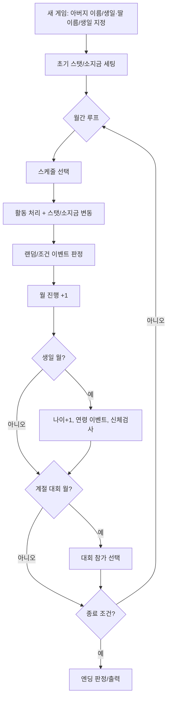
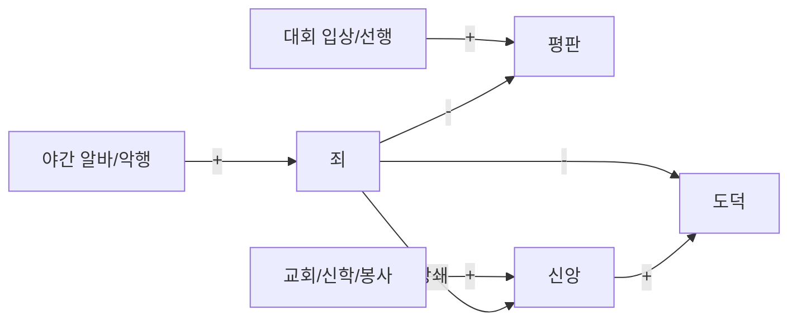
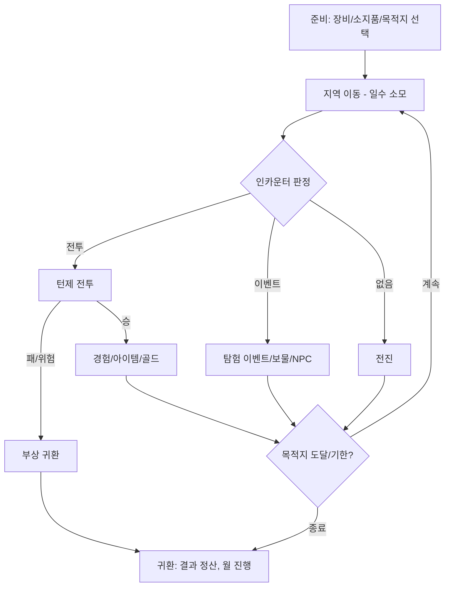
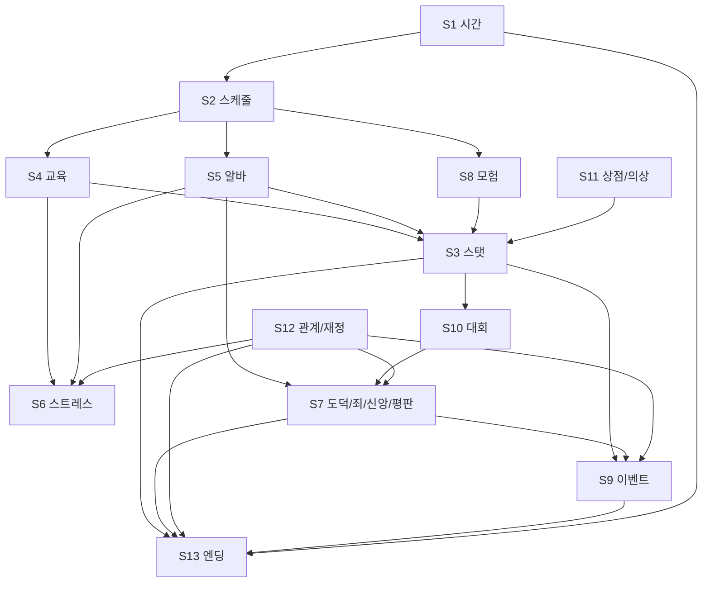

# 03. 게임 시스템 명세

> 본 문서는 게임의 **모든 시스템의 입력/처리/출력/상태전이**를 정의한다.
> 수치 상수는 본문에서 가리키고 실제 값은 `04_밸런스시트.md`에 둔다(단일 원천 원칙).
> 인수조건(검수 기준)은 `07_기능별_인수조건.md`에 1:1로 대응한다.

---

## S0. 전체 상태 구조 (개요)



**종료 조건**: ① 딸 나이 == 18세 도달(8년 경과) ② 조기 종료(가출·결혼·사망·특수 이벤트). 둘 중 먼저 발생.

---

## S1. 시간/캘린더 시스템

### 정의
- **단위**: 월(月). 1년 = 12개월. 총 8년 = **96개월(턴)**.
- **시작**: 딸 10세(생일 직후), 종료: 18세 생일 시점.
- **생일 월**: 게임 시작 시 지정한 딸의 생일 월. 매년 그 월에 나이 +1, 신체검사·연령 이벤트.
- **계절/대회 월**: 특정 월에 고정 이벤트(대회·축제). `04` 캘린더 테이블 참조.

### 처리
1. 월 시작 시 현재 상태(나이/소지금/스탯/스트레스/날짜) 표시.
2. 플레이어가 이번 달 스케줄 1종 확정.
3. 활동 처리 → 이벤트 판정 → 월 +1.
4. 생일/대회 월이면 해당 서브루틴 실행.

### 상태 변수
`year(0–8), month(1–12), age(10–18), turnIndex(0–95)`

### 인수조건 → 07 §AC-TIME

---

## S2. 스케줄 시스템

매월 다음 카테고리 중 **정확히 1종**을 선택한다.

| 카테고리 | 효과 요약 | 비용/보수 | 스트레스 |
|----------|-----------|-----------|----------|
| **교육(수업)** | 지정 스탯 상승 | 수업료 지출 | 증가(난이도별) |
| **아르바이트** | 보수 획득 + 스탯 변동 | 보수 수입 | 증가(직종별) |
| **휴식(바캉스)** | 스트레스 감소 | 소액 지출 또는 무료 | 감소 |
| **모험(원정)** | 전투 스탯·아이템·이벤트 | 보급품 지출 | 변동 |

### 규칙
- 일부 활동은 **개방 조건**(최소 스탯/나이/평판/소지금)을 가진다 → 미충족 시 선택 불가(회색).
- **연속 동일 고강도 활동**은 스트레스를 가중(누적 페널티) → S6 참조.
- 스케줄 확정 후에는 그 달은 변경 불가(되돌리기 없음, 단 확정 전 미리보기 제공).

### 처리 순서(월간 해결 파이프라인)
```
1) 비용 차감(수업료/보급) → 소지금 부족 시 선택 차단
2) 스탯 변동 적용(기본치 ± 보정: 컨디션/스트레스/계절/소질)
3) 스트레스 증감
4) 죄/도덕/신앙/평판 변동
5) 보수 입금(아르바이트)
6) 이벤트 판정(S9)
7) 상한/하한 클램프 → 상태 저장
```

### 인수조건 → 07 §AC-SCHED

---

## S3. 스탯(파라미터) 시스템

딸의 능력치는 4군으로 구성된다. **정확한 수치 범위·초기값·표시단위는 `04` 스탯 테이블**.

### S3.1 기본 능력치 (General)
| 키 | 명칭 | 의미 | 범위(권장) |
|----|------|------|-----------|
| `stamina` | 체력 | 활동 지속·전투 HP 기반 | 0–9999 |
| `strength` | 근력 | 물리 공격·노동 효율 | 0–999 |
| `intelligence` | 지력 | 학문·마법·대화 | 0–999 |
| `refinement` | 기품 | 우아함·귀족 평가 | 0–999 |
| `morals` | 도덕 | 선/악 성향 | 0–999 |
| `faith` | 신앙 | 종교·축복·죄 상쇄 | 0–999 |
| `sensitivity` | 감수성 | 예술·예민함 | 0–999 |
| `charm` | 매력 | 호감·인기(일부 파생) | 0–999 |
| `temperament` | 기질/자존심 | 성격·반항/순종 성향 | 0–999 |

### S3.2 전투 능력치 (Combat)
| 키 | 명칭 | 의미 |
|----|------|------|
| `hp` | HP | 전투 생명력(체력 파생) |
| `mp` | MP | 마법 자원 |
| `attack` | 공격력 | 물리 피해(근력+무기) |
| `defense` | 방어력 | 피해 경감(방어구) |
| `magicAttack` | 마법공격 | 마법 피해(지력+무기) |
| `magicDefense` | 마법방어 | 마법 경감 |
| `agility` | 민첩 | 행동 순서·회피 |

### S3.3 기능/숙련 (Skills)
| 키 | 명칭 | 주 획득처 |
|----|------|----------|
| `combatSkill` | 전투기술 | 무술도장·모험 |
| `magicSkill` | 마법 | 마법학교·모험 |
| `etiquette` | 예의범절/작법 | 예절학교·궁정 |
| `conversation` | 화술 | 학교·접객 아르바이트 |
| `art` | 예술 | 미술/음악 학교 |
| `cooking` | 요리 | 요리학교·식당 |
| `housework` | 가사 | 가사·가정부 |
| `nursing` | 간호 | 교회·병원(선택) |
| `dance` | 무용 | 무용학교 |
| `sexAppeal` | 색기 | 야간 접객(죄/도덕 트레이드오프) |

### S3.4 누적/숨김 파라미터
| 키 | 명칭 | 의미 |
|----|------|------|
| `stress` | 스트레스 | 0–100, 과도 시 페널티/반항 |
| `sin` | 죄 | 비도덕 누적, 엔딩 악영향 |
| `reputation` | 평판 | 세간 평가(대회/선행) |
| `gold` | 소지금 | 가문 자산(G) |
| `allowanceMood` | 용돈 만족도 | 월 용돈에 따른 호감 |
| `condition` | 컨디션 | 당월 신체 상태(이벤트/계절) |

### S3.5 도메인 평가치 (Evaluation, `H_*`) — 원작 확증
raw 스탯과 **별개로 누적**되는 분야별 평가. 대회 입상·특정 활동·이벤트로 상승하며 **엔딩 판정의 1차 입력**(문서 05 §8.0).
| 키 | 원작 변수 | 의미 |
|----|----------|------|
| `evalWarrior` | H_SENSHI | 전사 평가 |
| `evalMagic` | H_MAHO | 마법 평가 |
| `evalSocial` | H_SYAKOH | 사교 평가 |
| `evalHousework` | H_KAJI | 가사 평가 |
| (확장) | — | 예술/종교 등 추가 평가 |
> 내부 변수 ↔ 기획서 키 전체 매핑: `extract/text/VARIABLE_DICTIONARY.md`.

### 파생 공식(요지, 상세 `04`)
- `hp = f(stamina)` 예: `hp = floor(stamina × k_hp) + constBase`
- `attack = floor(strength × k_atk) + weaponAtk`
- `charm`은 일부 기품/감수성/색기/의상에서 파생 가중.
- `eval*`는 해당 분야 활동/입상 시 누적(예: 무투대회 입상 → `evalWarrior += 입상가중`).

### 인수조건 → 07 §AC-STAT

---

## S4. 교육(수업) 시스템

### 정의
딸을 학교/도장에 보내 지정 스탯을 올린다. 각 수업은 (수업료, 주 상승 스탯, 부 상승/하락, 스트레스, 개방조건)을 가진다. **전체 수업 목록·수치는 `04` 교육 테이블.**

### 처리
```
gain_i = base_i × seasonMod × aptitudeMod × (1 - stressPenalty) × randJitter
stat[target] += round(gain_i)
stress += stressCost_i
gold  -= tuition_i
```
- `aptitudeMod`: 소질/현재 스탯 구간에 따른 효율(높을수록 둔화 → 로그형 성장).
- 일부 상위 수업은 **선행 스탯/하위 수업 이수**가 개방조건.

### 대표 수업군 (상세 `04`)
- 일반교육(예절/교양), 무술도장, 마법학교, 미술/음악, 무용, 요리학교, 가정학, 신학교(교회), 검술/궁술 등.

### 인수조건 → 07 §AC-EDU

---

## S5. 아르바이트 시스템

### 정의
돈을 벌되 스탯이 변동하고 일부는 죄·스트레스를 키운다. 위험 직종은 사고 이벤트 가능.

### 처리
```
gold += wage_i × performanceMod        # performance = f(관련스탯, 컨디션)
stat[+] += plusGain_i ; stat[-] -= minusLoss_i
sin += sinCost_i ; morals -= moralsCost_i
stress += stressCost_i
if 위험직종: 사고확률 판정 → 부상/스탯손실/특수이벤트
```

### 직종 분류(상세 `04`)
- **안전·저보수**: 아기돌보기, 교회봉사, 가사도우미 → 도덕/감수성/신앙 ↑, 죄 0.
- **노동·체력**: 농장, 나무꾼, 목장 → 근력/체력 ↑, 기품 ↓.
- **접객·고보수**: 식당, 살롱 → 화술/매력 ↑, 스트레스 ↑.
- **야간·고위험**: 술집/유흥 접객 → 색기/매력 ↑·고수입, **죄↑·도덕↓·평판↓·스트레스↑**.
- **전투형**: 사냥/용병 → 전투스탯↑, 부상 위험.

### 인수조건 → 07 §AC-WORK

---

## S6. 스트레스 & 반항 시스템

### 정의
스트레스는 0–100. 과도하면 **컨디션 저하 → 능력치 효율 하락 → 반항/가출 이벤트**로 단계 악화.

### 단계(권장, 상세 `04`)
| 구간 | 상태 | 효과 |
|------|------|------|
| 0–29 | 안정 | 정상 효율 |
| 30–59 | 피로 | 성장 효율 -10~20% |
| 60–79 | 과부하 | 효율 -30%, 반항 이벤트 확률↑ |
| 80–100 | 위험 | 가출/사고/병 이벤트, 일부 활동 거부 |

### 완화 수단
- 휴식(바캉스), 용돈 지급, 선물(상점), 부녀 대화, 특정 이벤트.
- `stress -= restValue`(휴식 종류별, `04`).

### 인수조건 → 07 §AC-STRESS

---

## S7. 도덕·죄·신앙·평판 시스템

상호 연결된 사회/도덕 축. 엔딩 분기에 직접 영향(문서 05).



- **죄**: 누적값. 신앙 행위(교회·기도·헌금)로 일부 상쇄. 높으면 악계열 엔딩.
- **신앙**: 신학교·교회봉사·기도로 상승. 죄 상쇄, 축복 이벤트.
- **평판**: 대회 입상·선행·고귀한 처신으로 상승, 추문/야간직으로 하락. 귀족/왕족 엔딩 게이트.
- **도덕**: 선악 성향 종합. 엔딩·이벤트 분기.

수치/변동량 → `04` 도덕축 테이블. 인수조건 → 07 §AC-MORAL

---

## S8. 모험(원정) & 전투 시스템

### 정의
딸이 마을 밖 지역으로 원정을 떠나 **턴제 전투·탐험·이벤트·보물 획득**을 한다. RPG 파트.

### 구조


### 전투(턴제)
- 행동 순서: `agility` 기반.
- 명령: 공격(물리/무기), 마법, 아이템, 방어, 도망.
- 피해: `dmg = max(1, attack - targetDefense) × variance` / 마법 동일(magicAttack/magicDefense).
- 승리 보상: 전투스탯 경험·골드·아이템 드롭. 패배: 부상(스탯/HP 손실) 후 강제 귀환(사망 아님, 단 특수조건 제외).

### 지역/적/보상 테이블 → `04` 모험 테이블. 인수조건 → 07 §AC-ADV

---

## S9. 이벤트 시스템

### 종류
1. **정기**: 생일(연 1회·나이+1·신체검사), 계절 대회/축제(고정 월), 신년 운세.
2. **조건부**: 특정 스탯/죄/신앙/평판/관계 임계 도달 시 트리거.
3. **랜덤**: 월말 확률 발생(일상/사고/행운/만남).
4. **관계**: 부녀 대화, 큐브(집사), 여신, 마을 NPC, 구혼자.

### 판정
```
for each candidate event:
   if 조건(스탯/플래그/월/확률) 충족 → 우선순위순 1건 발생(또는 큐잉)
이벤트 결과: 스탯/플래그/소지금/관계 변동 + 분기 선택지(있을 시)
```
- 이벤트는 **플래그**로 1회성/반복 제어. 전체 이벤트 표 → `05`.

### 인수조건 → 07 §AC-EVENT

---

## S10. 대회/축제 시스템

특정 월에 열리는 경연. 입상 시 상금·평판·엔딩 가점.

| 대회(예) | 평가 스탯 | 보상 |
|----------|----------|------|
| 무투대회 | 전투기술/근력/공격 | 상금·전사 평판 |
| 마법대회 | 마법/지력 | 상금·마도 평판 |
| 예술/음악제 | 예술/감수성 | 상금·예술 평판 |
| 미인대회 | 매력/기품/색기 | 상금·인기 평판 |
| 학예/웅변 | 지력/화술 | 상금·학자 평판 |
| 무용제 | 무용/감수성 | 상금·예능 평판 |

- 순위 산정: 참가자(딸 + NPC 경쟁자) 점수 비교. NPC 점수는 해당 연차 난이도 곡선(`04`).
- 미니게임화 옵션(모바일): 대회를 경량 인터랙션으로 연출(문서 06).

### 인수조건 → 07 §AC-CONTEST

---

## S11. 상점·인벤토리·장비·의상 시스템

### 상점 카테고리
- **의상/액세서리**: 외형(포트레이트) 변경 + 기품/매력/색기 보정. 격식/일상/특수.
- **무기/방어구**: 전투 스탯. 모험 장착.
- **도구/약품**: 회복·스트레스 완화·이벤트 아이템.
- **음식/식재료**: 컨디션·요리.
- **책/교양**: 스탯 소폭·개방조건.

### 메커니즘
- 구매: `gold` 차감, 인벤토리 추가. 판매: 환급(구매가 일부).
- 장비: 무기/방어구/의상 슬롯. 의상은 **포트레이트 레이어 변경** + 스탯 보정(상황 적합도: 격식 자리에 일상복이면 평판 페널티).
- 가격/효과 표 → `04` 상점 테이블. 인수조건 → 07 §AC-SHOP

---

## S12. 관계·재정 시스템

### S12.1 부녀 관계
- **대화**: 월간/이벤트 시 선택지로 호감·기질·스트레스 조정.
- **용돈(Allowance)**: 매월 딸에게 지급액 설정 → 만족도/자존심/소비 습관(죄/낭비) 영향. `04` 용돈 테이블.
- 호감/신뢰 수치는 엔딩(가족 관련)과 반항 억제에 작용.

### S12.2 큐브(집사)
- 월말 보고(스탯 요약·조언), 상점/스케줄 안내, 가끔 유혹(죄 유발 선택지).

### S12.3 여신(어머니) / 신앙 이벤트
- 신앙 임계 시 축복(스탯/소지금/엔딩 가점), 가호.

### S12.4 가문 재정
- 수입: 아르바이트·대회 상금·모험 전리품·(옵션)아버지 연금.
- 지출: 수업료·생활비·용돈·상점·보급.
- 파산/적자 처리: 소지금 0 미만 불가(선택 차단). 생활비는 월 고정 지출(`04`).

### 인수조건 → 07 §AC-REL, §AC-MONEY

---

## S13. 엔딩 판정 시스템

### 정의
종료 시점(18세 또는 조기 종료)의 **스탯 프로필 + 평판/죄/신앙/관계 + 달성 플래그**로 70여 종 엔딩 중 1개 결정.

### 판정 알고리즘(권장)
```
1) 하드 조건 우선(가출/사망/특수 결혼 등 플래그) → 해당 엔딩 즉시
2) 직업/신분 엔딩: 카테고리별 점수 = w·관련스탯합 + 평판/죄 보정
   예) 여왕/공주: 기품·지력·매력·평판 高 & 죄 低
       장군/전사: 전투기술·근력·공격 高
       대마도사: 마법·지력 高
       성녀/수녀: 신앙·도덕 高 & 죄 低
       예술가: 예술·감수성 高
       (악) 마왕의 신부/유녀: 죄·색기 高
3) 최고 점수 카테고리 → 세부 엔딩(임계 충족도/평판/관계로 변형)
4) 조건 미달 시 평범 엔딩(평민 결혼/가업) 폴백
```
- 전체 엔딩 표(조건/우선순위/분기) → `05_이벤트_엔딩.md`.
- 컬렉션/도감(모바일): 해금 엔딩 기록(문서 06).

### 인수조건 → 07 §AC-ENDING

---

## S14. 신규 게임 / 초기화

- 입력: 아버지 이름·생일(별자리/혈액형 → 초기 보정 옵션), 딸 이름·생일.
- 초기값: 기본 스탯 프리셋 + 생일 보정 + 시작 소지금(`04` 초기화 테이블).
- 별자리/혈액형: 원작은 시작 스탯/성향에 보정 → `04`에 보정표(없으면 0 보정으로 단순화 가능, 옵션 플래그).

### 인수조건 → 07 §AC-NEWGAME

---

## 시스템 간 의존 맵


---

## 충족 체크리스트 (이 문서 기준)
- [x] 14개 시스템의 입력/처리/출력/상태전이 명세 (C1)
- [x] 시스템 간 의존 관계 도식화 (C1)
- [x] 모든 수치를 `04`로 위임(단일 원천) (C2 연결)
- [x] 각 시스템 → `07` 인수조건 매핑 (C4 연결)

_다음 문서: `04_밸런스시트.md`_
