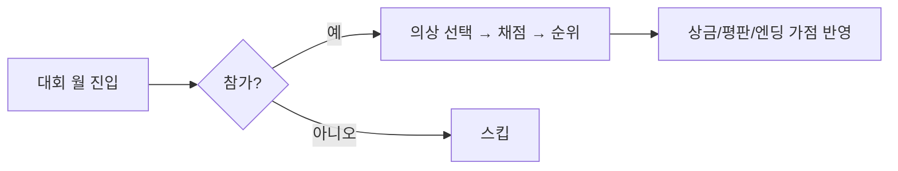
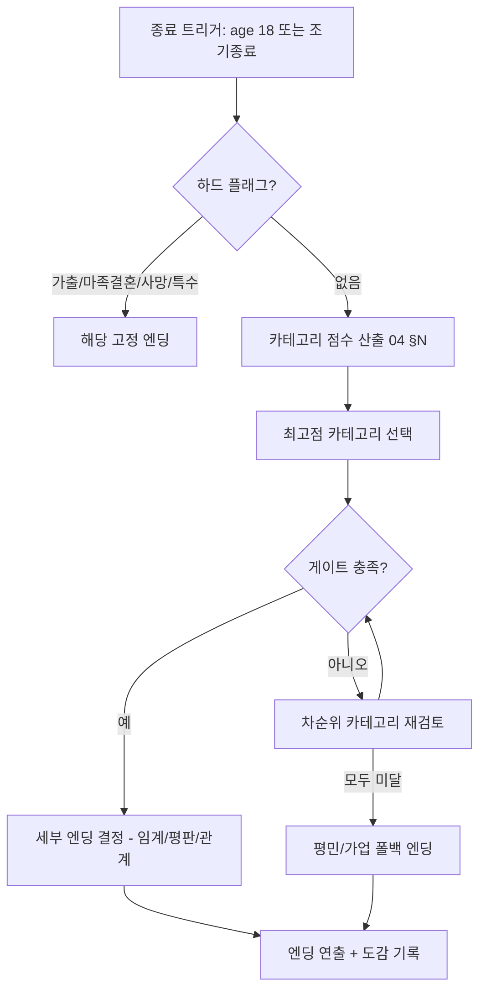

# 05. 이벤트 및 엔딩

> 시스템 동작은 `03 §S9/S10/S13`, 수치는 `04 §I/M/N` 참조.
> 텍스트(대사)는 **신규 창작 대상**(개요 §5). 본 문서는 **트리거 조건·결과·분기 구조**를 정의한다.
> 이벤트 ID와 플래그는 `08_데이터스키마_세이브.md`의 이벤트 스키마와 1:1.

---

## 0. 원작 검증 (스크립트 해독)

`extract/text/TXTX_script.txt`(디버그 메뉴)에서 **실재 확인된** 이벤트/기능 — 본 문서 설계의 근거:
- 대회/축제: **예술제·무투회·무용·요리·시합·표창**(P21~P26), **수확제**(전용 스크립트 `SS*`=TXS).
- 특수 이벤트: **인어 만나기**, **도장의 폐관(閉館)**, **아버지 생일**, **행상인(行商人)**, **무도자의 도전**, **도장 파괴/도장 킬러**, **결혼**.
- 시스템: **돌발(랜덤) 이벤트 ON/OFF**, **이벤트 조건/실행 횟수** 플래그, **엔딩 파라미터** 계산(외부 모듈 `ENDING.COM`), **이름 입력**(`NAMEIN.COM`).
- 사건 징글(연출): 쇼크/요인 면회/기쁜 사건/슬픈 사건/사망/팡파레(`02 §9` B1~B7).

> 아래 분류·테이블은 이 검증 목록 + PM2 표준 설계를 통합한 것이다.

## 1. 이벤트 분류 체계

| 분류 | 트리거 | 빈도 |
|------|--------|------|
| 정기(SEASONAL) | 고정 월 (캘린더 `04 §B`) | 연 1회 |
| 생애주기(LIFECYCLE) | 나이/연차 도달 | 1회성 |
| 조건(CONDITIONAL) | 스탯/죄/신앙/평판/관계 임계 | 충족 시 1회 |
| 랜덤(RANDOM) | 월말 확률 | 반복 |
| 관계(RELATION) | NPC 상호작용 | 조건/랜덤 |
| 위기(CRISIS) | 스트레스/죄/재정 악화 | 임계 시 |

---

## 2. 정기 이벤트 (SEASONAL)

| ID | 월 | 내용 | 결과 |
|----|----|----|----|
| EV_NEWYEAR | 1 | 신년 운세: 그해 행운 스탯 점지, 소원 1택 | 선택 스탯 성장률 +10%(연간) |
| EV_ART_FEST | 3 | 예술/음악제(대회) | `04 §M` |
| EV_DANCE_FEST | 6 | 무용제(대회) | `04 §M` |
| EV_SUMMER | 7 | 바캉스 시즌 | 휴식 효율 +20% |
| EV_MARTIAL | 8 | 무투대회 | `04 §M` |
| EV_SCHOLAR | 9 | 학예/웅변대회 | `04 §M` |
| EV_HARVEST | 10 | 수확제 | 소지금 보너스 +300~800G, 마을 호감 |
| EV_MAGIC_FEST | 11 | 마법대회 | `04 §M` |
| EV_BEAUTY | 12 | 미인대회 | `04 §M` |

대회 공통 흐름:

---

## 3. 생애주기 이벤트 (LIFECYCLE)

| ID | 시점 | 내용 | 결과 |
|----|------|------|------|
| EV_BIRTH_10 | 시작 | 입양/대면, 큐브 소개, 튜토리얼 | 초기화 |
| EV_BIRTHDAY | 매년 생일월 | 나이+1, 신체검사(스탯 리포트), 생일선물 1택 | 선택 보너스 |
| EV_PUBERTY | age 13~14 | 2차 성징 이벤트(감수성/기질 변동) | sensitivity +, temperament 변동 |
| EV_FIRST_LOVE | age 15+ & charm≥200 | 첫사랑/구혼자 등장 시작 | 관계 플래그 개시 |
| EV_COMING_AGE | age 18 도달 | 성년/엔딩 진입 | 엔딩 판정 |

신체검사(EV_BIRTHDAY) 리포트 항목: 전 스탯 스냅샷 + 전년 대비 증감 + 큐브 코멘트(빌드 방향 힌트).

---

## 4. 조건 이벤트 (CONDITIONAL) — 대표

| ID | 조건 | 결과/분기 |
|----|------|----------|
| EV_TALENT_ART | art≥300 | 예술가 스카웃(평판+, 예술 엔딩 가점) |
| EV_KNIGHT_SCOUT | combatSkill≥300 & reputation≥60 | 기사단 입단 제안(전사 엔딩 가점) |
| EV_MAGE_SCOUT | magicSkill≥300 | 마법사 길드 초청(마도 엔딩 가점) |
| EV_BLESSING | faith≥200 | 여신의 축복(stat 일괄+, sin 일부 소멸) |
| EV_TEMPTATION | sin≥80 | 큐브의 유혹(악 분기 선택지) |
| EV_NOBLE_INVITE | refinement≥300 & reputation≥70 | 귀족 무도회 초청(공주/귀족 엔딩 게이트) |
| EV_SCANDAL | (야간직 누적) reputation<30 | 추문(평판-, 일부 엔딩 차단) |
| EV_PRINCE | charm≥350 & refinement≥250 & age≥16 | 왕자 구혼(왕비/공주 엔딩 게이트) |
| EV_RICH | gold≥10000 | 상회 제안(상인 엔딩 가점) |

---

## 5. 랜덤 이벤트 (RANDOM) — 월말 풀

월말 1건 확률 발생. 카테고리별 가중. (텍스트는 신규 창작, 효과 골격만 정의)

| 카테고리 | 예시 효과 | 빈도 |
|----------|----------|------|
| 행운 | 길에서 소지금 습득(+50~200G), 우연한 만남(stat+) | 보통 |
| 일상 | 친구와 외출(stress-, charm+), 독서(intelligence+) | 높음 |
| 사고 | 가벼운 부상(stamina-), 분실(gold-) | 낮음 |
| 도덕 선택 | 분실물 습득 → 신고(morals+) vs 착복(sin+, gold+) | 보통 |
| 건강 | 감기(condition-, 활동 효율↓ 1개월) | 낮음 |
| 큐브 | 조언/잡담(힌트), 장난(미세 변동) | 보통 |

---

## 6. 관계 이벤트 (RELATION)

### 6.1 부녀(아버지)
| ID | 트리거 | 분기/결과 |
|----|--------|----------|
| EV_TALK | 월간/요청 | 대화 선택지 → 호감/기질/stress 조정 |
| EV_GIFT | 상점 선물 | allowanceMood+, 호감+ |
| EV_REBEL | stress≥60 | 반항 대화 → 달래기/방치 분기 |

### 6.2 큐브(집사)
- 월말 보고(필수), 상점 안내, 유혹 이벤트(EV_TEMPTATION), 큐브 호감 루트(특수 엔딩 가능).

### 6.3 구혼자/연애
| ID | 조건 | 결과 |
|----|------|------|
| EV_SUITOR_COMMON | age≥15 & charm≥150 | 평민 구혼자 → 결혼 엔딩 분기 |
| EV_SUITOR_NOBLE | EV_NOBLE_INVITE 후 | 귀족 구혼자 |
| EV_SUITOR_PRINCE | EV_PRINCE 후 | 왕자 → 왕족 결혼 엔딩 |
| EV_SUITOR_DEMON | sin≥150 | 마족 구혼 → 악 엔딩 |

---

## 7. 위기 이벤트 (CRISIS)

| ID | 조건 | 결과 |
|----|------|------|
| EV_OVERSTRESS | stress≥80 | 병/거부/사고 분기, 일부 활동 1개월 차단 |
| EV_RUNAWAY | stress≥80 누적 3개월 & temperament 낮음 | 가출 → 수색 미니이벤트 → 실패 시 조기 종료(가출 엔딩) |
| EV_BANKRUPT | gold<생활비 지속 | 긴축(활동 제한), 큐브 경고 |
| EV_FALL | sin≥250 | 타락 분기 → 악 엔딩 고정 위험 |

---

## 8. 엔딩 시스템 (S13 상세)

### 8.0 원작 엔딩 입력 (스크립트 변수 확증)
`extract/text/VARIABLE_DICTIONARY.md`(TXTX 주석 복원)로 확인된 원작 엔딩 입력:
1. **도메인 평가치 `H_*`**: `H_SENSHI`(전사)·`H_MAHO`(마법)·`H_SYAKOH`(사교)·`H_KAJI`(가사) 등 — raw 스탯과 별개로 누적되는 분야 평가. 본 문서 엔딩 카테고리와 대응.
2. **주력 활동(ENDNM[])**: `가장 많이 실행한 훈련`(ENDNM10–12)·`가장 많이 실행한 아르바이트`(ENDNM13–15)와 그 횟수/랭크.
3. **총합점(ENDNM18, 総合点)** 및 죄(`B_INGYO`)·신앙·평판·관계 플래그.

→ 아래 판정 알고리즘은 이 3축(평가·주력활동·총점)을 `04 §N` 가중치와 결합한 모바일 재현이다.

### 8.1 판정 순서

### 8.2 엔딩 카탈로그 (REF — 약 70종, 카테고리별)

> 각 엔딩: ID / 필요조건(게이트 + 임계) / 분기 변형. 텍스트는 신규 창작.

#### A. 왕족·귀족 (Royalty)
| ID | 조건 |
|----|------|
| END_QUEEN | refinement≥600, intelligence≥500, charm≥500, reputation≥85, sin<40, EV_PRINCE |
| END_PRINCESS | 왕자 결혼(EV_SUITOR_PRINCE), charm≥400, refinement≥350 |
| END_NOBLE_WIFE | 귀족 결혼, refinement≥350, etiquette≥300, reputation≥60 |
| END_COURTLADY | refinement≥400, etiquette≥350, reputation≥70 (미혼 궁정) |

#### B. 무·전사 (Martial)
| ID | 조건 |
|----|------|
| END_GENERAL | combatSkill≥600, strength≥400, reputation≥70 |
| END_KNIGHT | combatSkill≥500, EV_KNIGHT_SCOUT |
| END_MERCENARY | combatSkill≥400, reputation<50 |
| END_GUARD | combatSkill≥300 (폴백 전사) |

#### C. 마법 (Magic)
| ID | 조건 |
|----|------|
| END_ARCHMAGE | magicSkill≥600, intelligence≥500 |
| END_COURT_MAGE | magicSkill≥450, reputation≥60 |
| END_WITCH | magicSkill≥400, sin≥80 |
| END_SCHOLAR_MAGE | magicSkill≥350, intelligence≥450 |

#### D. 종교 (Religious)
| ID | 조건 |
|----|------|
| END_POPE | faith≥600, morals≥500, sin<10, reputation≥80 |
| END_SAINT | faith≥500, morals≥450, sin<20 |
| END_NUN | faith≥350, sin<40 |
| END_PRIESTESS | faith≥300, intelligence≥300 |

#### E. 예술·학문 (Art & Scholar)
| ID | 조건 |
|----|------|
| END_GREAT_ARTIST | art≥600, sensitivity≥450, reputation≥70 |
| END_PAINTER | art≥400 (회화 편중) |
| END_MUSICIAN | art≥400, sensitivity≥450 (음악 편중) |
| END_DANCER | dance≥500, charm≥350 |
| END_SCHOLAR | intelligence≥600, conversation≥300 |
| END_TEACHER | intelligence≥400 |
| END_WRITER | intelligence≥450, sensitivity≥350 |

#### F. 생활·상업 (Civic)
| ID | 조건 |
|----|------|
| END_MERCHANT | gold누적≥10000, conversation≥300 |
| END_CHEF | cooking≥500 |
| END_INNKEEPER | housework≥400, cooking≥300 |
| END_NURSE | nursing≥450, morals≥300 |
| END_HOUSEWIFE | 평민 결혼, housework≥250 (폴백 결혼) |
| END_COMMONER | 모든 게이트 미달 폴백 |

#### G. 악·타락 (Dark)
| ID | 조건 |
|----|------|
| END_DEMON_BRIDE | sin≥200, EV_SUITOR_DEMON |
| END_DEMON_QUEEN | sin≥300, magicSkill≥400 |
| END_COURTESAN | sexAppeal≥400, sin≥120 |
| END_OUTLAW | sin≥150, combatSkill≥300 |
| END_RUNAWAY | EV_RUNAWAY 성립(조기 종료) |

#### H. 특수·관계 (Special)
| ID | 조건 |
|----|------|
| END_ADVENTURER | AREA_DEMON 클리어 플래그, combatSkill≥400 |
| END_HERO | 마계 보스 격파 플래그, reputation≥70 |
| END_CUBE_ROUTE | 큐브 호감 최대 + 특정 선택 누적 |
| END_INDEPENDENT | 어느 분야도 극단 없이 균형 + reputation≥60 |

> 합계 약 38개 대표 엔딩 + 임계/평판/관계 변형으로 **70여 변형** 도달(세부 변형 규칙은 8.3).

### 8.3 세부 변형 규칙
- 동일 카테고리 내 **임계 초과 폭**과 **평판/죄/관계**로 상위/하위 변형 분기:
  - 예) END_GENERAL: reputation≥85 & 마계 클리어 → "전설의 영웅 장군" 변형, reputation 70~84 → "왕국 장군", <70 → "변경 수비대장".
- 결혼 상대(평민/귀족/왕자/마족)·미혼(독립)으로 추가 변형.
- 부녀 호감 최상 시 모든 엔딩에 "아버지와의 작별" 에필로그 변형 추가.

### 8.4 도감/컬렉션 (모바일, 문서 06)
- 해금 엔딩 그리드(예: 8×9). 잠금=실루엣, 해금=썸네일+조건 요약.
- 회차 종료 후 "근접했던 미달 엔딩 Top3" 힌트 제공(재도전 유도).

---

## 충족 체크리스트 (이 문서 기준)
- [x] 이벤트 6분류 + 대표 트리거/결과 (C1)
- [x] 엔딩 판정 알고리즘 + 카테고리별 게이트/임계 (C1, C2 연계)
- [x] 약 70 변형 엔딩 카탈로그 (C1)
- [x] 도감/재도전 설계(모바일) (C1)
- [ ] 개별 이벤트 대사·세부 분기 텍스트: 신규 창작(범위 §5)

_다음 문서: `02_비주얼_컨셉.md`_
