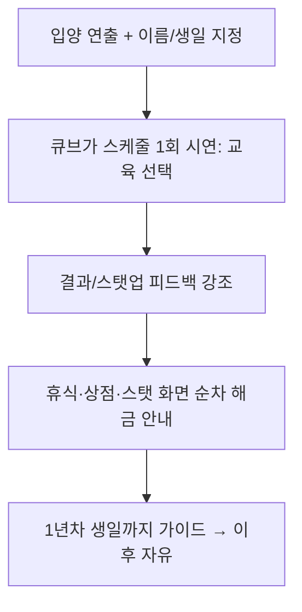

# 06. 모바일 적응 설계

> 원작(DOS, 마우스/키보드, 가로 4:3)을 **세로 터치 모바일**로 재설계하는 기준.
> 게임 시스템 자체는 03~05를 따르고, 본 문서는 **입력·레이아웃·세션·수익화·접근성·기술스택**을 정의한다.

---

## 1. 설계 원칙

1. **세로 한 손 조작**: 핵심 행동(스케줄 선택)은 화면 하단 1/3 thumb-zone에서 완결.
2. **세션 단축**: 1세션 3~7분(= 1~수개월 진행). 언제든 중단/재개.
3. **결정의 가독성**: 모든 선택의 비용/효과/잠금 사유를 카드에 즉시 노출(미리보기).
4. **수집 동기**: 엔딩 도감 + 회차 변주로 반복 플레이 유도(원작의 70+ 엔딩 활용).
5. **오프라인 우선**: 서버 없이 로컬 세이브로 완결(개요 §5).

---

## 2. 입력 매핑 (마우스 → 터치)

| 원작 입력 | 모바일 |
|-----------|--------|
| 메뉴 클릭 | 카드/버튼 탭 |
| 스케줄 캘린더 넘김 | 월 진행 버튼 / 스와이프 |
| 드래그(없음) | 없음 |
| 우클릭(취소) | 뒤로(◀) 버튼 / 시스템 백 |
| 키보드 단축 | 하단 탭바 |
| 전투 명령 | 큰 명령 버튼(공격/마법/아이템/도망) |

제스처: 좌우 스와이프=탭 전환, 길게 누르기=상세 툴팁, 당겨서 새로고침 없음.

---

## 3. 레이아웃 / 세이프존

- 기준 캔버스 1080×1920. 상단 노치/하단 제스처바 안전영역 confirm.
- 영역 분할:
```
상단(0~12%)   : 상태바(날짜·나이·소지금·스트레스/평판 미니게이지)
중앙(12~62%)  : 캐릭터 포트레이트 / 배경 / 연출
대화(62~74%)  : 큐브/내레이션 말풍선
액션(74~100%) : 스케줄 카드·탭바(thumb-zone)
```
- 터치 타겟 최소 48×48dp, 카드 높이 ≥72dp.

---

## 4. 세션 / 진행 페이싱

| 지표 | 목표 |
|------|------|
| 1탭→결과 피드백 | < 0.5s |
| 1개월 처리(선택~결과) | 10~20s |
| 1세션 | 3~7분(3~12개월 진행) |
| 1회차(8년) | 누적 2~4시간 |
| 첫 엔딩 도달(튜토리얼 회차) | 30~50분(가이드 빌드) |

- **자동 저장**: 매월말. 수동 슬롯 3개 + 자동 슬롯 1개.
- **빠른 진행**: "이대로 한 학기(3개월) 반복" 옵션(동일 활동 일괄, 이벤트는 정상 판정).
- **중단 복귀**: 앱 재시작 시 마지막 월 시작 지점 복원.

---

## 5. 온보딩 / 튜토리얼


- 강제 단계 최소화(3~4스텝), 이후 비강제 힌트(큐브 코멘트).

---

## 6. 리텐션 / 라이브옵스 훅 (1차는 플레이스홀더)

| 훅 | 설명 | 1차 |
|----|------|-----|
| 엔딩 도감 | 수집 진행률·근접 미달 힌트 | 포함 |
| 일일 보상(옵션) | 출석 → 소액 골드/아이템 | 플래그 |
| 시즌 이벤트(옵션) | 캘린더 연동 한정 의상 | 플래그 |
| 도전 과제 | "신앙 엔딩 달성" 등 | 포함(로컬) |
| 공유 | 엔딩 결과 카드 이미지 공유 | 선택 |

---

## 7. 수익화 (플레이스홀더 — 실 SDK 제외)

> 실결제/광고 SDK 연동은 범위 외(개요 §5). **훅 인터페이스만** 정의.

| 모델 | 적용 | 비고 |
|------|------|------|
| 보상형 광고(옵션) | 휴식 효율 +, 모험 부활, 골드 부스트 | `AdHook.showRewarded()` 인터페이스 |
| IAP(옵션) | 광고 제거, 의상 코스메틱 팩, 추가 세이브 슬롯 | 코스메틱 위주(P2W 지양) |
| 가격/밸런스 영향 | **엔딩 달성에 결제 불필요**(공정성) | 핵심 원칙 |

비결제 완주 가능이 원칙. 결제는 편의/코스메틱.

---

## 8. 접근성 / 현지화

- 글자 크기 3단계, 색약 모드(게이지 색+패턴 병행).
- 텍스트 외부화(i18n): 한국어 기본, 영어 확장 슬롯. 폰트는 유니코드.
- 햅틱: 스탯업/구매/승리 약한 진동(설정 토글).
- 사운드 on/off, BGM/효과음 개별 볼륨.

---

## 9. 기술 스택 권장

| 항목 | 권장 | 근거 |
|------|------|------|
| 엔진 | **Phaser + TypeScript + Vite**(웹/캐주얼) 또는 Unity(스토어 네이티브) | 2D UI·스프라이트 중심, 빠른 반복 |
| 상태관리 | 결정적 게임 상태(순수 함수 리듀서) + 직렬화 세이브 | 공식/세이브 테스트 용이(문서 08) |
| 저장 | 로컬(IndexedDB/파일) JSON, 스키마 버전 마이그레이션 | 오프라인 우선 |
| 데이터 | 밸런스 테이블을 **외부 데이터(JSON/CSV)** 로 분리 | 비개발자 밸런싱(문서 04↔08) |
| AppsInToss(선택) | 게임 로직과 마켓 어댑터 분리 | 마켓 확장 |

> 엔진은 레포/출시 타겟에 맞춰 확정. 게임 로직(상태머신·공식)은 엔진 비의존 순수 모듈로 작성하여 검증(테스트) 가능하게 한다.

---

## 10. 성능 / 빌드 목표

- 60fps UI, 저사양 기기에서 30fps 하한.
- 초기 로딩 < 5s, 월 전환 < 1s.
- 에셋: 텍스처 아틀라스, 오디오 스트리밍.

---

## 충족 체크리스트 (이 문서 기준)
- [x] 입력 매핑·세로 레이아웃·세이프존 (C3 연계)
- [x] 세션 페이싱·자동저장·온보딩 (C1)
- [x] 리텐션/수익화 훅을 플레이스홀더로 (C7)
- [x] 기술스택·성능 목표 (C5 연계)

_다음 문서: `07_기능별_인수조건.md`_
