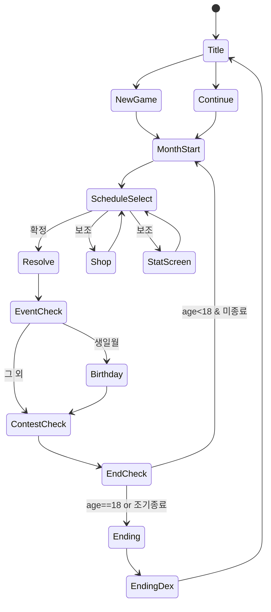

# 08. 데이터 스키마 및 세이브

> `04 밸런스시트`의 표를 **로드 가능한 데이터 파일**로, 게임 진행 상태를 **세이브 스키마**로 정의한다.
> 게임 로직은 데이터-드리븐: 밸런스는 코드가 아니라 데이터에서 읽는다(비개발자 밸런싱 가능, `06 §9`).

---

## 1. 데이터 파일 구조 (정적 마스터 데이터)

`data/` 하위에 JSON(또는 CSV→빌드 시 JSON 변환). 키는 `04`의 ID와 일치.

```
data/
  config.json          # 초기값/캘린더/공식 상수 (04 §A,B,C,D,H,J)
  classes.json         # 교육 (04 §E)
  jobs.json            # 아르바이트 (04 §F)
  rests.json           # 휴식 (04 §G)
  shop_items.json      # 상점 (04 §K)
  areas.json           # 모험 지역 (04 §L.1)
  enemies.json         # 적 (04 §L.2)
  contests.json        # 대회 (04 §M)
  events.json          # 이벤트 (05)
  endings.json         # 엔딩 (05 §8.2, 04 §N)
  i18n/ko.json         # 문구(신규 창작 텍스트)
```

### 1.1 config.json (발췌)
```json
{
  "startAge": 10, "endAge": 18, "totalMonths": 96,
  "startGold": 3000, "startReputation": 50, "startFaith": 10,
  "startStats": { "stamina": 250, "strength": 15, "intelligence": 20,
    "refinement": 10, "sensitivity": 30, "charm": 30, "temperament": 50,
    "morals": 40, "faith": 10 },
  "statBounds": { "stamina": [0, 9999], "default": [0, 999], "stress": [0, 100],
    "reputation": [0, 100] },
  "growth": { "softCapDefault": 600, "softCapAdvanced": 900,
    "jitter": [0.9, 1.1], "seasonMatch": 1.2, "seasonMiss": 0.9 },
  "stressTiers": [
    { "max": 29, "mod": 1.00, "rebel": 0.00 },
    { "max": 59, "mod": 0.90, "rebel": 0.03 },
    { "max": 79, "mod": 0.70, "rebel": 0.12 },
    { "max": 100, "mod": 0.55, "rebel": 0.30 } ],
  "livingCost": 80, "allowanceOptions": [0, 50, 100, 200, 400],
  "calendar": [
    { "month": 1, "event": "EV_NEWYEAR" }, { "month": 3, "event": "EV_ART_FEST" },
    { "month": 6, "event": "EV_DANCE_FEST" }, { "month": 7, "event": "EV_SUMMER" },
    { "month": 8, "event": "EV_MARTIAL" }, { "month": 9, "event": "EV_SCHOLAR" },
    { "month": 10, "event": "EV_HARVEST" }, { "month": 11, "event": "EV_MAGIC_FEST" },
    { "month": 12, "event": "EV_BEAUTY" } ],
  "derived": {
    "hp": "floor(stamina*0.5)+20+weaponDefBonus",
    "attack": "floor(strength*1.0)+combatSkill*0.3+weaponAtk",
    "charm": "floor(refinement*0.4+sensitivity*0.3+sexAppeal*0.3)+dressCharmBonus"
  }
}
```

### 1.2 classes.json (스키마)
```json
{
  "EDU_ETIQUETTE": {
    "name": "예절교실", "tuition": 120,
    "gains": { "refinement": 12, "etiquette": 10 },
    "deltas": {}, "stress": 6, "season": null,
    "requires": {}
  },
  "EDU_DOJO": {
    "name": "무술도장", "tuition": 220,
    "gains": { "strength": 14, "combatSkill": 10, "stamina": 6 },
    "deltas": { "refinement": -3 }, "stress": 10,
    "requires": { "stamina": 150 }
  }
}
```
> 전체 항목은 `04 §E` 표를 1:1로 직렬화. `gains`=성장공식 적용 대상, `deltas`=고정 증감.

### 1.3 jobs.json (스키마)
```json
{
  "JOB_BAR": {
    "name": "술집접객", "wage": 320, "perfStat": "charm",
    "gains": { "sexAppeal": 12, "charm": 8 },
    "deltas": { "morals": -6, "reputation": -4 },
    "sin": 6, "stress": 12, "accident": 0.0,
    "requires": { "age": 14, "charm": 200 }
  }
}
```

### 1.4 enemies.json / areas.json
```json
// areas.json
{ "AREA_FOREST": { "name": "근교 숲", "recAttack": 20, "days": 5,
    "goldRange": [30,60], "drops": ["ITM_POTION","WPN_DAGGER"],
    "encounterRate": 0.5, "enemyPool": ["E_SLIME","E_GOBLIN"] } }
// enemies.json
{ "E_GOBLIN": { "name": "고블린", "hp": 60, "attack": 22, "defense": 10,
    "magicDefense": 0, "agility": 12, "exp": { "combatSkill": 4, "strength": 1 } } }
```

### 1.5 endings.json (스키마)
```json
{
  "END_QUEEN": {
    "name": "여왕", "category": "royalty",
    "weights": { "refinement": 2, "intelligence": 1.5, "charm": 1.5, "reputation": 3 },
    "gate": { "sin": { "lt": 40 }, "reputation": { "gte": 80 },
              "flags": ["EV_PRINCE"] },
    "variants": [
      { "id": "END_QUEEN_LEGEND", "when": { "reputation": { "gte": 90 }, "flags": ["AREA_DEMON_CLEAR"] } }
    ],
    "priority": 100
  }
}
```

### 1.6 events.json (스키마)
```json
{
  "EV_BLESSING": {
    "type": "conditional", "once": true, "priority": 50,
    "trigger": { "faith": { "gte": 200 } },
    "effects": { "statsAll": 5, "sin": -20 },
    "choices": []
  },
  "EV_LOST_ITEM": {
    "type": "random", "weight": 10,
    "choices": [
      { "id": "report", "effects": { "morals": 5, "reputation": 2 } },
      { "id": "keep", "effects": { "sin": 8, "gold": 150 } }
    ]
  }
}
```

---

## 2. 세이브 스키마 (런타임 상태)

```json
{
  "version": 1,
  "seed": 123456789,
  "meta": { "fatherName": "...", "daughterName": "...",
            "birthMonth": 4, "createdAt": 0, "savedAt": 0 },
  "time": { "year": 5, "month": 4, "age": 15, "turnIndex": 64 },
  "stats": {
    "stamina": 250, "strength": 140, "intelligence": 210, "refinement": 180,
    "sensitivity": 95, "charm": 150, "temperament": 60, "morals": 120, "faith": 60,
    "combatSkill": 120, "magicSkill": 30, "etiquette": 90, "conversation": 70,
    "art": 160, "cooking": 40, "housework": 50, "nursing": 0, "dance": 80, "sexAppeal": 0
  },
  "meters": { "stress": 45, "sin": 12, "reputation": 72, "gold": 1240,
              "allowanceMood": 20, "condition": 0 },
  "relations": { "fatherAffinity": 60, "cubeAffinity": 30, "suitor": null },
  "inventory": [ "DRESS_FORMAL", "WPN_SWORD", "ITM_POTION" ],
  "equipped": { "dress": "DRESS_FORMAL", "weapon": "WPN_SWORD", "armor": null },
  "flags": { "EV_PUBERTY": true, "EV_PRINCE": false, "AREA_DEMON_CLEAR": false,
             "contestWins": { "EV_MARTIAL": 1 } },
  "settings": { "astrologyMod": false, "fatherPension": false },
  "endingDex": [ "END_NUN", "END_PAINTER" ]
}
```

### 필드 규칙
- `seed`: 결정적 랜덤(AC-ENDING-4). 모든 랜덤은 이 시드 기반 PRNG.
- `flags`: 1회성 이벤트/달성 플래그. `contestWins`: 대회별 입상 누적.
- `endingDex`: 해금 엔딩(도감). 세이브 외 별도 영구 저장 권장(회차 간 유지).
- 스탯/미터는 `04` 범위로 항상 클램프 후 저장(AC-STAT-1).

---

## 3. 게임 상태 머신 (런타임)



---

## 4. 월간 처리 의사코드 (결정적 리듀서)

```
function resolveMonth(state, choice):
    rng = PRNG(state.seed, state.time.turnIndex)
    # 1) 비용
    cost = activityCost(choice)
    assert state.meters.gold >= cost          # AC-SCHED-2
    state.meters.gold -= cost
    # 2) 스탯 변동(성장공식 04 §D, stressMod 04 §H)
    applyGains(state, choice, rng)
    # 3) 스트레스
    state.meters.stress += choice.stress; clamp()
    # 4) 도덕축
    applyMoralDeltas(state, choice)
    # 5) 보수
    if choice.isJob: state.meters.gold += wage * perfMod(state, choice)
    # 6) 위험 판정
    if choice.accident && rng.chance(choice.accident): applyAccident(state, rng)
    # 7) 이벤트
    ev = pickEvent(state, rng)                # AC-EVENT-1
    if ev: applyEvent(state, ev)
    # 8) 재정/용돈
    state.meters.gold -= state.settings.livingCost + state.settings.allowance
    applyAllowanceMood(state)
    # 9) 신앙 상쇄
    if state.stats.faith >= 100: state.meters.sin = max(0, sin - floor(faith/100))
    # 10) 시간 진행
    advanceTime(state)                        # AC-TIME-1
    clampAll(state); save(state)              # AC-SAVE-1
    return state
```

---

## 5. 마이그레이션

- 세이브 `version` 정수 증가. 로더는 `version < CURRENT`면 순차 마이그레이터 적용(AC-SAVE-3).
- 신규 스탯/플래그 추가 시 기본값으로 채움. 데이터 ID 제거 시 매핑 테이블로 대체.

---

## 6. 테스트 데이터셋(권장)

- **결정성 테스트**: 고정 seed + 스크립트 입력 → 엔딩 ID 스냅샷 비교(AC-ENDING-4).
- **공식 단위 테스트**: `04 §C/D/L.3` 공식별 입력→출력 케이스.
- **세이브 라운드트립**: 직렬화→역직렬화 동일성(AC-SAVE-2).
- **밸런스 시뮬**: 대표 빌드 5종(전사/마도/성녀/예술/악) 자동 플레이 → 목표 엔딩 도달 검증.

---

## 충족 체크리스트 (이 문서 기준)
- [x] 정적 마스터 데이터 스키마(밸런스 외부화) (C2/C5)
- [x] 세이브 스키마 + 필드 규칙 (C5)
- [x] 상태 머신 + 월간 처리 의사코드(결정적) (C1/C5)
- [x] 마이그레이션 + 테스트 데이터셋 (C5)

_기획서 끝. 추출 에셋은 `../extract/` 참조._
