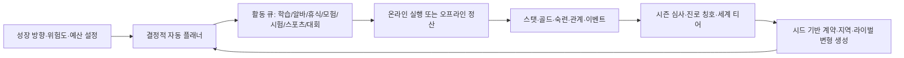

# 10. 현대형 무한 성장 GDD — 왕립 아카데미

> 상태: 구현 정본 v1.0  
> 원작 분석 문서 `00~09`는 콘텐츠·수치·비주얼 레퍼런스다. 본 문서와 충돌하는 18세 종료, 월 1회 수동 선택, 원작 인물/텍스트/에셋 사용 규칙은 본 문서가 우선한다.

## 0. 제품 결정

- 게임명(작업명): **Princess Tycoon: 왕립 아카데미**
- 장르: 세로형 모바일 방치형 육성 시뮬레이션 + 자동 원정/시험/리그
- 대상: 짧은 확인 플레이와 장기 최적화를 좋아하는 12세 이상 이용자
- 플랫폼: Godot 4.x, Android/iOS/Web(AppsInToss 후보), 390×844 기준 세로 화면
- 핵심 판타지: 플레이어가 성장 방향과 안전 규칙을 정하면 성인 수련생이 스스로 학습·노동·모험·시험·스포츠·대회를 순환하며 자신만의 전문가로 성장한다.
- 종결: **강제 엔딩 없음**. 기존 38개 엔딩은 반복 획득 가능한 `진로 칭호`로 바꾼다.
- 주인공: 18세 이상의 성인 왕립 아카데미 수련생. 원작의 미성년 성적 대상화 요소는 사용하지 않는다.
- 아트: 원작 추출물은 연구 레퍼런스만 사용한다. 1차 플레이어블은 절차 드로잉, 기하 아이콘, 라이선스가 확인된 한글 폰트로 제작하며 유료 생성 API를 사용하지 않는다.

## 1. 플레이 시간별 경험

| 시간 | 플레이어가 하는 일 | 게임이 하는 일 |
|---|---|---|
| 10초 | 현재 활동 결과 확인, 방향 프리셋 전환, 즉시 활동 1회 | 스탯·골드·스트레스 변화와 다음 자동 선택 이유 표시 |
| 3분 | 자동 큐 조정, 계약 보상 수령, 장비 교체 | 학습/알바/휴식/도전 10~30회를 해결 |
| 30분 | 한 시즌 결산, 시험·대회·원정 성과 비교 | 진로 칭호·세계 티어·새 활동 변형 해금 |
| 7일 | 성장 방향을 재설계하고 새로운 전문 분야 개척 | 주간 계약, 라이벌 리그, 절차 생성 콘텐츠 갱신 |

## 2. 코어 루프



### 2.1 조작 원칙

- 플레이어는 개별 월 스케줄을 반복 입력하지 않는다.
- `성장 방향`, `금지 태그`, `최소 보유금`, `최대 스트레스`, `위험 허용도`를 지정한다.
- 정책 변경은 진행 중 활동을 취소하지 않고 **다음 활동 선택부터** 적용한다.
- 즉시 실행 버튼은 자동 플래너가 고른 다음 활동을 같은 리듀서로 1회 처리한다. 별도 보상 경로를 만들지 않는다.
- 자동 진행은 언제든 일시정지할 수 있다.

## 3. 시간과 시즌

- 논리 단위 `slot`: 게임 내 1일의 핵심 활동 1회.
- 온라인: 활동별 `durationSlots × 5초` 후 해결한다.
- 오프라인: 실제 60초당 1 slot, 최대 8시간(`480 slots`)을 동일 리듀서로 순차 처리한다.
- 28 slots = 1시즌, 4시즌 = 1연차. 연차는 나이가 아니며 상한이 없다.
- 시즌 말 자동 심사에서 도전 성과·정책 일치도·균형을 평가하고 명성과 칭호를 지급한다.
- 기기 시간이 뒤로 이동하면 오프라인 시간은 0으로 처리하고 현재 저장을 유지한다.

## 4. 성장 상태

### 4.1 능력치

| 그룹 | 키 | 표시명 |
|---|---|---|
| 기본 | `stamina`, `strength`, `intelligence`, `refinement`, `sensitivity`, `style`, `discipline`, `morals`, `faith` | 체력, 근력, 지력, 기품, 감수성, 스타일, 절제, 도덕, 신앙 |
| 숙련 | `combat`, `magic`, `etiquette`, `communication`, `art`, `cooking`, `housework`, `nursing`, `dance` | 전투, 마법, 예절, 소통, 예술, 요리, 생활, 간호, 무용 |
| 미터 | `energy`, `stress`, `reputation` | 에너지 0~100, 스트레스 0~100, 평판 0 이상 |

- 모든 성장 스탯과 평판은 상한이 없다.
- `style`은 의상 감각·무대 존재감·자기표현을 뜻한다. 성적 매력 수치가 아니다.
- 죄/타락 대신 `integrity` 위반 카운터를 사용한다. 불공정 선택은 단기 이득과 평판/관계 손실을 만든다.
- 전투 패배는 사망이나 회차 종료 없이 부상, 스트레스, 강제 휴식으로 처리한다.

### 4.2 성장 방향

기본 프리셋은 `균형`, `무예`, `학문`, `예술`, `리더십`, `돌봄`, `탐험`, `번영` 8종이다. 각 프리셋은 능력치 가중치 합 1.0과 태그 선호를 가진다. 플레이어는 사용자 정의 가중치를 저장할 수 있다.

자동 플래너의 후보 활동 효용은 다음과 같다.

```text
statValue = Σ(profileWeight[s] × expectedGain[s] / (1 + sqrt(stat[s] / 100)))
goldValue = max(0, reward-cost) / max(100, reserveGold) × prosperityWeight × 25
questBonus = 0.18 if activity advances pinned contract else 0
preferredTagBonus = min(0.12, 0.04 × preferredTagMatchCount)
noveltyBonus = 0.08 / (1 + sameActivityCountInLast8)
riskPenalty = activityRisk × (1-riskTolerance) × 0.75
stressPenalty = max(0, stress+activityStress-maxStress) / 20
score = statValue + goldValue + questBonus + preferredTagBonus + noveltyBonus - riskPenalty - stressPenalty
```

하드 제약은 점수보다 먼저 적용한다.

1. 잠금 조건 미충족, 금지 태그, 비용 지불 불가 활동 제외.
2. `gold-cost < reserveGold`인 소비 활동 제외.
3. `energy < 20` 또는 `stress >= maxStress`면 회복 활동 강제.
4. 가능한 활동이 없으면 `REST_HOME` 선택.
5. 동점은 `seed + rngCounter + activityId`의 안정 해시 순으로 결정한다.

시즌 도전은 위 정책 제약의 명시적 예외다. 해금 조건은 항상 지키되 지정 슬롯에는 금지 태그·회복 강제·최소 보유금보다 자동 참가를 우선한다. 참가비 전액이 부족하면 해당 회차 비용을 0으로 지원하고, 지불 가능한 경우에는 정상 차감한다. 장기 활동과 자동 큐는 현재·다음 시즌의 가장 가까운 도전 슬롯을 덮지 않도록 보류한다.

## 5. 활동 콘텐츠

정적 기본 콘텐츠 43종을 제공한다. 수치 원천은 `godot/data/activities.json`이며 구체 계약은 문서 11을 따른다.

| 분류 | 수 | 예시 | 해결 방식 |
|---|---:|---|---|
| 학습 | 15 | 예절, 문학, 회화, 음악, 무용, 요리, 신학, 무술, 검술, 마법, 간호 | 비용 지불 → 성장/스트레스 |
| 아르바이트 | 11 | 돌봄, 봉사, 농장, 식당, 공연장, 외교 행사, 경비, 귀족 저택 | 보수·숙련·위험 사건 |
| 휴식 | 4 | 집, 산책, 근교 여행, 휴양 | 에너지 회복·스트레스 감소 |
| 모험 | 5 | 숲, 동굴, 유적, 화산 지대, 균열 관문 | 자동 전투·전리품·지역 숙련 |
| 시험/스포츠/대회 | 8 | 아카데미 시험, 마법 실기, 무투, 무용, 예술, 웅변, 요리, 원정 리그 | 시즌 일정에 자동 참가, 점수 비교 |

### 5.1 공통 성장 공식

```text
focusMod = 0.85 + 0.50 × profileWeight[targetStat]
conditionMod = clamp(1 - stress/160, 0.40, 1.00) × clamp(0.60 + energy/100, 0.60, 1.60)
milestoneCount(L) = I(L≥10) + I(L≥25) + I(L≥50) + I(L≥100) + floor(max(0,L-100)/100)
masteryMod = 1 + 0.02 × sqrt(activityMastery) + 0.03 × milestoneCount(activityMastery)
relationMod = min(1.20, 1 + 0.0002 × relevantRelation)
diminishMod = 0.35 + 0.65 / (1 + stat/(600 + 80×worldTier))
tierMod = 1 + 0.04 × sqrt(worldTier-1)
jitter = U(0.95, 1.05), seeded
gain = round2(baseGain × focusMod × conditionMod × masteryMod × relationMod × diminishMod × tierMod × jitter)
```

- 고정 손실은 `diminishMod`를 적용하지 않는다.
- `relevantRelation`은 학습·모험=`steward`, 아르바이트=`citizens`, 도전=`rival`, 휴식=`guardian`이다.
- 마스터리는 일반 활동 완료마다 1 증가하고, 도전은 `rewardTable`의 참가/통과/우수 경험치 1/3/5만큼 증가하며 상한이 없다.
- 비용은 `baseCost × 1.11^(worldTier-1)`, 보수는 `baseReward × 1.13^(worldTier-1) × performanceMod`다.
- `performanceMod = clamp(0.75 + effective(primaryStat)/(220+40×worldTier), 0.75, 1.75)`이며, `primaryStat`은 해당 활동의 성장량을 반영한 직후의 원시 상태값이다. 위험 업무 사고가 발생하면 별도의 seeded 사고 보상 배율을 추가 적용한다.
- 큰 골드와 누적 골드는 `{mantissa, exponent}` 10진 정규화 값으로 저장한다.

### 5.2 자동 도전

- 도전 점수는 `effective(x)=100×ln(1+x/100)`을 사용해 한 스탯의 폭주를 완화한다.
- `playerScore = Σ(effective(stat)×weight) + gearScore + masteryBonus + seasonBonus + U(-5,5)`.
- `seasonBonus = challengeSeasonDifficultyRate × sqrt(seasonIndex-1) × (jitterMax-jitterMin)`이며, 라이벌 기준 점수와 플레이어 실점수에 동일하게 적용해 장기 시즌에서도 승률 밴드를 보존한다.
- 상대 난이도는 현재 세계 티어, 시즌, 직전 최고 기록으로 생성한다. 강점·약점·성격을 반영한 뒤에도 도전별 실효 승률을 40~75%로 재보정해, 외부 계약인 35~80% 범위에 마진을 둔 5단계 리그를 배치한다.
- 실패해도 참가 경험 30%, 관계 변화, 다음 시도 힌트를 지급한다.
- 시험·대회·스포츠가 같은 자동 해결 인터페이스를 쓰되 평가 가중치, 연출 문구, 보상 테이블은 분리한다.

### 5.3 자동 모험/전투

- 지역마다 3개 노드(탐색→조우/사건→보스)를 자동 해결한다.
- 물리 피해: `max(1, floor((attack-defense)×U(0.85,1.15)))`.
- 마법 피해: `max(1, floor((magicAttack-magicDefense)×U(0.85,1.15)))`.
- HP가 0이면 부상 상태, `stamina -20`, `stress +12`, 다음 활동을 휴식으로 강제한다.
- 클리어 횟수와 지역 티어는 무한히 증가하며 같은 지역의 적 이름·특성·보상은 템플릿 조합으로 변형된다.

## 6. 무한 콘텐츠 구조

무한 성장은 단순 숫자 복사만으로 처리하지 않는다. 다음 5개 축을 함께 조합한다.

1. **세계 티어**: `worldTier = 1 + floor(log2(1 + lifetimeRenown/250))`. 비용·보상·도전 난이도·접두사 풀이 확장된다.
2. **활동 숙련**: 기본 활동마다 무한 레벨. 10/25/50/100 이후 매 100레벨에 효율 마일스톤을 지급한다.
3. **절차 계약**: `행동 템플릿 × 분야 태그 × 지역 × 제약 × 보너스 목표`를 주간 seed로 조합한다. 불가능 조건은 현재 해금 상태를 검사해 제거한다.
4. **라이벌 리그**: 플레이어의 유효 점수 주변에서 성격·강점·약점이 다른 5명을 생성한다. 같은 seed/티어에서는 동일하다.
5. **진로 칭호 숙련**: 기존 38개 엔딩을 종결 없는 칭호로 변환한다. 조건을 다시 달성할 때마다 별이 오르며 5성 이후 `명인 +N`이 무한 증가한다.

생성 콘텐츠의 정본 descriptor는 `kind/templateId/tier/seed/modifiers/reward/expirySeason`이다. 계약은 여기에 `id/status/progress/target/tracking/bonusObjective/relationAffinity` 같은 가변 진행 상태를 함께 저장하고, 라이벌·지역은 도전별 점수와 지역 누적을 재현하는 생성 descriptor를 저장한다. 이름·설명은 라이선스가 안전한 신규 한국어 조각으로 결정적으로 만들며 세이브 호환을 위한 표시 cache는 허용하되 규칙의 원천으로 사용하지 않는다. 최근 8개와 같은 템플릿은 가중치를 20%로 낮춘다.

## 7. 시즌 심사와 진로 칭호

- 28 slots마다 심사를 실행한다. 게임은 멈추지 않는다.
- 심사 보상: `renown = floor(20 + challengeWins×8 + completedContracts×5 + policyFit×30)`.
- `policyFit`은 최근 28회 활동의 실제 성장 벡터와 설정 벡터의 코사인 유사도(0~1)다.
- 38개 진로 조건을 모두 평가해 신규 칭호 또는 별을 지급한다.
- 가까운 칭호 3개는 부족한 핵심 조건을 보여준다.
- 타락/가출/결혼 엔딩은 각각 `그림자 협상가`, `독립 개척자`, `왕실 동반자`처럼 비종결·비성적 진로로 재창작한다.
- 어떠한 심사·칭호·관계 상태도 세이브를 종료하거나 강제 초기화하지 않는다.

## 8. 이벤트와 관계

- 고정 이벤트 카드 26종: 계절 8, 성장 4, 조건 5, 랜덤 5, 관계 4.
- 이벤트는 한 활동 해결당 최대 1건을 `eventInbox`에 넣고 자동 진행을 멈추지 않는다.
- 선택형 이벤트는 기본 안전 선택을 1개 지정한다. 24시간 동안 입력이 없으면 기본 선택을 적용한다.
- 관계: `후견인`, `비서`, `라이벌`, `왕국 시민` 4축, 각 0~1000. 대화/선물/계약/도전 결과로 변한다.
- 관계는 보너스, 계약 태그, 칭호 변형을 열지만 연애·결혼을 강제하지 않는다.

## 9. 상점과 장비

- 기본 상점 21종: 의상/장신구 7, 무기/방어구 7, 소비품 7.
- 인벤토리는 `{id, count}`로 저장하고 장비 슬롯은 `outfit/weapon/armor/accessory` 4개다.
- 판매가는 구매가의 50%, 소비품 최대 중첩 99.
- 장비 수치는 세계 티어에 맞춰 생성되는 강화 레벨을 가지며 외형은 색·문양·장식 레이어로 절차 변형한다.
- 원작 추출 스프라이트를 런타임에 포함하지 않는다.

## 10. 모바일 UI

### 10.1 화면

1. 타이틀/이어하기
2. 새 수련생/성장 방향 설정
3. 홈: 캐릭터, 현재 활동, 자동 진행, 핵심 자원, 최근 결과
4. 계획: 프리셋, 사용자 가중치, 위험/예산/스트레스 규칙, 금지 태그
5. 활동: 기본/생성 콘텐츠, 잠금 이유, 수동 1회 실행
6. 성장: 전체 능력치, 숙련, 장비
7. 월드: 모험, 시험, 스포츠, 대회, 라이벌 리그
8. 기록: 시즌, 계약, 38개 진로 칭호, 이벤트 도감
9. 상점/인벤토리
10. 설정/접근성/데이터 초기화
11. 오프라인 정산 모달
12. 이벤트 선택 모달

### 10.2 레이아웃 계약

- 내부 기준 390×844, `canvas_items + keep`, 세로 고정.
- 390×844, 430×932, 720×1280에서 필수 CTA가 잘리거나 겹치지 않아야 한다.
- 본문 16px 상당 이상, 터치 영역 44×44pt 상당 이상, 텍스트 대비 4.5:1 이상.
- 하단 탭은 홈/계획/활동/성장/기록 5개. 보조 화면은 시트 또는 상단 뒤로가기로 연다.
- 현재 자동 활동, 다음 선택 이유, 오프라인 상한, 자동 일시정지 상태를 항상 확인할 수 있다.

## 11. 비주얼·사운드

- 무드: 고전 왕실 아카데미를 현대 모바일 카드 UI로 재해석한 `midnight navy + parchment + coral + gold`.
- 캐릭터: 절차 드로잉 페이퍼돌 `body/face/hair/outfit/accessory/aura` 레이어. 성장 분야와 장비가 색·소품·오라에 반영된다.
- 배경: 그라디언트와 단순 기하로 학당, 거리, 숲, 경기장, 도서관을 구분한다.
- 애니메이션: 활동 진행 링, 스탯 플로팅, 심사 카드, 칭호 별 상승. 광과민 옵션에서는 플래시 제거.
- 오디오: 1차는 합성 톤 기반 버튼/보상/실패 효과음과 무음 기본 BGM 훅. 외부 유료 API나 원작 음원은 사용하지 않는다.

## 12. 세이브와 결정성

- 로컬 JSON, `schemaVersion=2`, 임시 파일→원자 교체→`.bak` 복구.
- 자동 저장: 활동 해결 후, 정책 변경 후, 앱 백그라운드 진입 시.
- 필수 상태: `seed`, `rngCounter`, `lastSimulatedAt`, `time`, `stats`, `meters`, `bigValues`, `growthPolicy`, `activityQueue`, `activeTask`, `mastery`, `inventory`, `equipment`, `relations`, `worldTier`, `seasonHistory`, `generatedContent`, `eventInbox`, `careerTitles`, `lifetimeStats`, `settings`.
- 같은 seed, 초기 상태, 정책, 시간 입력은 온라인/오프라인 모두 같은 활동 선택과 결과를 만든다.
- v1 원작형 세이브가 들어오면 이름·스탯·골드·도감만 보존하고 v2 무한형 기본 상태를 채우는 마이그레이션을 제공한다.

## 13. 범위 경계

### 1차 구현에 포함

- 위 12개 화면의 기능 경로
- 43개 기본 활동, 26개 이벤트, 21개 상점 품목, 38개 진로 칭호
- 자동 플래너, 온라인/오프라인 진행, 절차 계약/라이벌/지역 변형
- 자동 모험/전투, 시험/스포츠/대회, 관계, 장비, 세이브/마이그레이션
- 한국어 UI, 절차 비주얼, 로컬 분석 훅 인터페이스, 광고/IAP no-op 포트

### 포함하지 않음

- 원작 텍스트·이미지·음악의 상용 런타임 포함
- 유료 이미지/음악 생성 API
- 실제 광고/IAP SDK, 서버, 클라우드 저장, 멀티플레이, 스토어 등록/출시
- 강제 엔딩, 하드 리셋 프레스티지, 미성년 성적 묘사, 확률형 유료 뽑기

## 14. 구현 단계와 게이트

| 단계 | 산출 | 게이트 |
|---|---|---|
| P1 | 프로젝트, 데이터 로더, PRNG, BigValue, 상태/세이브, 활동 리듀서 | 결정성·라운드트립·마이그레이션 |
| P2 | 자동 플래너, 43개 활동, 온라인/오프라인 진행, 홈/계획/활동 | 정책·fallback·cap·rollback |
| P3 | 모험/도전, 이벤트, 관계, 상점/장비 | 승패·보상·인벤토리·선택 큐 |
| P4 | 절차 계약/라이벌/지역, 시즌 심사, 38개 칭호 | 같은 seed 동일 생성·tier 10,000 안정성 |
| P5 | 12개 기능 경로, 절차 아트, 접근성, 오디오 훅, 전체 QA | headless/import 로그·모바일 3종·실행 스모크 |

구현 완료 판정은 문서 11의 인수조건을 전부 자동 또는 런타임 증거로 확인한 경우에만 가능하다.
